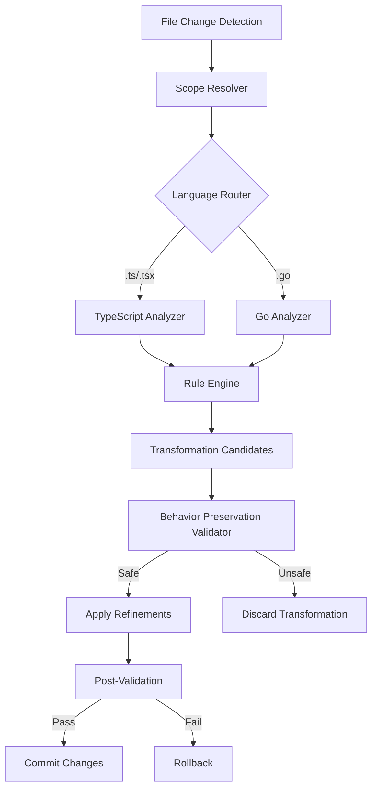

# Design Document: Code Simplifier

## Overview

The Code Simplifier is an autonomous refinement agent that operates as a set of rule-based code transformation passes. It analyzes recently modified code in the workspace, identifies refinement opportunities against project-specific coding standards, and applies transformations that improve clarity, consistency, and maintainability while strictly preserving observable behavior.

The agent targets three language domains within the workspace:
- **TypeScript/React** (frontend/src/) — ES module conventions, function declarations, explicit types, import sorting, React component patterns
- **Go** (backend/) — naming conventions, error handling, early returns, import grouping
- **JavaScript/Electron** (electron/) — treated as a subset of the TypeScript rules where applicable

The design follows a pipeline architecture: detect changed files → parse and analyze → match rules → validate transformations → apply refinements.

## Architecture



The system operates as a single-pass pipeline per refinement cycle:

1. **File Change Detection** — Identifies recently modified files in the workspace session
2. **Scope Resolver** — Narrows the target to modified sections and their immediate context within each file
3. **Language Router** — Dispatches files to the appropriate language-specific analyzer
4. **Analyzers** — Parse code into AST representations and identify rule violations
5. **Rule Engine** — Matches violations against the project's rule set, ordered by priority (standards first, then clarity)
6. **Behavior Preservation Validator** — Verifies each transformation preserves public API signatures, error paths, side-effect order, and return values
7. **Apply & Validate** — Applies safe transformations and runs post-validation (type checking / compilation)

## Components and Interfaces

### 1. FileChangeDetector

Responsible for identifying which files have been recently modified.

```typescript
interface FileChangeDetector {
  getModifiedFiles(): string[];
  getModifiedSections(filePath: string): CodeSection[];
}

interface CodeSection {
  filePath: string;
  startLine: number;
  endLine: number;
  content: string;
}
```

### 2. ScopeResolver

Determines the refinement scope based on defaults (recently modified) or explicit developer request.

```typescript
interface ScopeResolver {
  resolve(modifiedFiles: string[], explicitScope?: string[]): ScopeResult;
}

interface ScopeResult {
  files: string[];
  sections: Map<string, CodeSection[]>;
  isExplicit: boolean;
}
```

### 3. LanguageRouter

Routes files to the correct analyzer based on file extension.

```typescript
interface LanguageRouter {
  route(filePath: string): LanguageAnalyzer;
}

type SupportedLanguage = 'typescript' | 'go';
```

### 4. LanguageAnalyzer

Parses code and identifies rule violations. One implementation per supported language.

```typescript
interface LanguageAnalyzer {
  language: SupportedLanguage;
  analyze(section: CodeSection): RuleViolation[];
}

interface RuleViolation {
  ruleId: string;
  severity: 'standard' | 'clarity';
  location: CodeSection;
  description: string;
  suggestedFix: Transformation;
}
```

### 5. RuleEngine

Holds the full set of project rules and orchestrates matching. Rules are applied in priority order: standards enforcement before clarity enhancements.

```typescript
interface RuleEngine {
  matchRules(violations: RuleViolation[]): Transformation[];
  getPrioritizedRules(language: SupportedLanguage): Rule[];
}

interface Rule {
  id: string;
  language: SupportedLanguage;
  category: 'standard' | 'clarity' | 'naming';
  priority: number;
  match(section: CodeSection): RuleViolation | null;
  transform(section: CodeSection): Transformation;
}
```

### 6. Transformation

Represents a proposed code change.

```typescript
interface Transformation {
  ruleId: string;
  filePath: string;
  original: string;
  refined: string;
  startLine: number;
  endLine: number;
}
```

### 7. BehaviorPreservationValidator

Validates that a transformation does not alter observable behavior.

```typescript
interface BehaviorPreservationValidator {
  validate(transformation: Transformation, context: CodeSection): ValidationResult;
}

interface ValidationResult {
  safe: boolean;
  reason?: string;
}
```

Validation checks:
- Public API signatures unchanged (function names, parameter types, return types)
- Error handling paths preserved
- Side-effect execution order maintained
- No removal of reachable code paths

### 8. RefinementPipeline

Orchestrates the full refinement cycle.

```typescript
interface RefinementPipeline {
  run(scope?: string[]): RefinementReport;
}

interface RefinementReport {
  filesAnalyzed: number;
  transformationsApplied: Transformation[];
  transformationsDiscarded: Transformation[];
  errors: string[];
}
```

## Data Models

### Rule Definitions

Rules are categorized by language and type. Each rule has a unique ID following the pattern `{language}.{category}.{name}`.

**TypeScript/React Rules:**

| Rule ID | Category | Description |
|---------|----------|-------------|
| `ts.standard.es-modules` | standard | Enforce ES module import/export syntax |
| `ts.standard.import-sort` | standard | Sort imports: external → internal → relative, separated by blank lines |
| `ts.standard.function-keyword` | standard | Use `function` keyword for named declarations |
| `ts.standard.explicit-return-types` | standard | Add explicit return type annotations to exported functions |
| `ts.standard.component-declaration` | standard | Define React components as named function declarations |
| `ts.standard.props-interface` | standard | Define component props using TypeScript interfaces |
| `ts.naming.camelCase` | naming | camelCase for locals, params, unexported functions |
| `ts.naming.PascalCase` | naming | PascalCase for components, interfaces, type aliases |
| `ts.naming.descriptive` | naming | Replace single-letter variables (except short lambdas/loop indices) |
| `ts.clarity.guard-clauses` | clarity | Extract guard clauses and early returns to reduce nesting |
| `ts.clarity.remove-redundancy` | clarity | Remove unused variables, unreachable code, duplicate logic |
| `ts.clarity.no-nested-ternary` | clarity | Replace nested ternaries with if/else or helpers |
| `ts.clarity.consolidate-logic` | clarity | Group related scattered logic into cohesive blocks |
| `ts.clarity.remove-restating-comments` | clarity | Remove comments that restate code without adding context |

**Go Rules:**

| Rule ID | Category | Description |
|---------|----------|-------------|
| `go.standard.naming` | standard | camelCase unexported, PascalCase exported |
| `go.standard.error-handling` | standard | Check and handle all error return values |
| `go.standard.early-returns` | standard | Use early returns for error conditions |
| `go.standard.import-grouping` | standard | Group imports: stdlib → external → internal, separated by blank lines |
| `go.naming.descriptive` | naming | Descriptive names, no single-letter except idiomatic (i, j, err) |
| `go.clarity.guard-clauses` | clarity | Extract guard clauses to reduce nesting |
| `go.clarity.remove-redundancy` | clarity | Remove unused variables, unreachable code |
| `go.clarity.consolidate-logic` | clarity | Group related logic into cohesive blocks |

### Refinement Pass State

```typescript
interface RefinementPassState {
  triggeredAt: Date;
  scope: ScopeResult;
  phase: 'detecting' | 'analyzing' | 'transforming' | 'validating' | 'complete';
  violations: RuleViolation[];
  appliedTransformations: Transformation[];
  discardedTransformations: Transformation[];
}
```

### Balance Constraints

The following constraints are checked before applying any transformation:

```typescript
interface BalanceCheck {
  preservesAbstractions: boolean;      // Req 5.1
  noUnrelatedCombining: boolean;       // Req 5.2
  noComplexFunctionalChains: boolean;  // Req 5.3
  preservesIntermediateVars: boolean;  // Req 5.4
  readabilityNotReduced: boolean;      // Req 5.5
}
```

A transformation is only applied if all balance checks pass.


## Correctness Properties

*A property is a characteristic or behavior that should hold true across all valid executions of a system — essentially, a formal statement about what the system should do. Properties serve as the bridge between human-readable specifications and machine-verifiable correctness guarantees.*

### Property 1: Behavior Preservation Invariant

*For any* code section and any refinement produced by the Code Simplifier, either the refined code preserves all observable behavior (return values, side effects, event emissions, error propagation) of the original, or the refinement is discarded and the original code is left unchanged.

**Validates: Requirements 1.1, 1.5**

### Property 2: Structural Preservation

*For any* code section with exported functions or error handling paths, after refinement, the set of public API signatures (function names, parameter types, return types) and the set of error handling paths and messages must be identical to the original.

**Validates: Requirements 1.2, 1.3**

### Property 3: Side-Effect Order Preservation

*For any* code section containing side-effect-producing statements, after refinement, the relative ordering of those statements must be identical to the original.

**Validates: Requirements 1.4**

### Property 4: ES Module Enforcement

*For any* TypeScript file after refinement, all import and export statements must use ES module syntax exclusively (no `require()` or `module.exports`).

**Validates: Requirements 2.1**

### Property 5: Import Sort Order

*For any* TypeScript file after refinement, import statements must be ordered with external packages first, then internal modules, then relative imports, with each group separated by a blank line.

**Validates: Requirements 2.2**

### Property 6: Function Keyword Usage

*For any* TypeScript or React file after refinement, all named function declarations must use the `function` keyword rather than arrow function expressions assigned to variables.

**Validates: Requirements 2.3**

### Property 7: Explicit Return Types

*For any* TypeScript file after refinement, all exported functions and public methods must have explicit return type annotations.

**Validates: Requirements 2.4**

### Property 8: React Component Pattern

*For any* React component file after refinement, components must be defined as named function declarations with props defined via a TypeScript interface (not inline type annotations).

**Validates: Requirements 2.5, 2.6**

### Property 9: Go Naming Conventions

*For any* Go file after refinement, unexported identifiers must use camelCase and exported identifiers must use PascalCase.

**Validates: Requirements 3.1**

### Property 10: Go Error Handling Completeness

*For any* Go file after refinement, every function call that returns an error value must have that error checked and handled at the call site.

**Validates: Requirements 3.2**

### Property 11: Go Early Returns

*For any* Go file after refinement containing error conditions, error handling must use early return patterns rather than nested else blocks.

**Validates: Requirements 3.3**

### Property 12: Go Import Grouping

*For any* Go file after refinement, import statements must be grouped into standard library, external packages, and internal packages sections, each separated by a blank line.

**Validates: Requirements 3.4**

### Property 13: Nesting Depth Reduction

*For any* code section where guard clauses or early returns are applicable, the maximum nesting depth after refinement must be less than or equal to the nesting depth before refinement.

**Validates: Requirements 4.1**

### Property 14: Redundancy Removal

*For any* code section after refinement, there must be no unused variables, unreachable code blocks, or duplicate logic that existed in the original.

**Validates: Requirements 4.2**

### Property 15: No Nested Ternaries

*For any* code section after refinement, there must be no nested ternary operators. Any nested ternaries present in the original must be replaced with if/else statements or extracted helper functions.

**Validates: Requirements 4.3**

### Property 16: Abstraction Preservation

*For any* code section after refinement, the number of distinct functions and modules must be greater than or equal to the original count — no existing abstractions that separate concerns may be inlined or removed.

**Validates: Requirements 5.1**

### Property 17: Intermediate Variable Preservation

*For any* code section containing named intermediate variables that clarify computation intent, those variables must still be present after refinement (not inlined into larger expressions).

**Validates: Requirements 5.4**

### Property 18: Scope Containment

*For any* refinement pass with default scope, only recently modified files are analyzed, only modified sections (and their immediate surrounding context) within those files are changed, and no files outside the resolved scope are modified.

**Validates: Requirements 6.1, 6.3, 6.4**

### Property 19: Explicit Scope Expansion

*For any* refinement pass where a developer provides an explicit scope (files or directories), the simplifier must analyze exactly those specified targets and no others.

**Validates: Requirements 6.2**

### Property 20: Single-Pass Completeness

*For any* set of code modifications in a session, the Code Simplifier must identify all refinement opportunities in the changed sections and process all of them in a single pass per modified section.

**Validates: Requirements 7.1, 7.3**

### Property 21: Standards-Before-Clarity Ordering

*For any* refinement pass that applies both standards and clarity transformations, all standards-category transformations must be applied before any clarity-category transformations.

**Validates: Requirements 8.3**

### Property 22: Post-Refinement Compilation

*For any* refinement applied by the Code Simplifier, the resulting code must compile successfully and maintain type correctness.

**Validates: Requirements 8.4**

### Property 23: TypeScript Naming Conventions

*For any* TypeScript file after refinement, local variables, function parameters, and non-exported functions must use camelCase, while React component names, TypeScript interfaces, and type aliases must use PascalCase.

**Validates: Requirements 9.1, 9.2**

### Property 24: Descriptive Naming

*For any* code section after refinement, there must be no single-letter variable names except in short lambda parameters and loop index variables (e.g., `i`, `j`).

**Validates: Requirements 9.4**

## Error Handling

### Pipeline Errors

| Error Scenario | Handling Strategy |
|---|---|
| File read/parse failure | Skip the file, log warning, continue with remaining files |
| AST parsing error | Skip the affected section, report in RefinementReport |
| Transformation produces invalid code | Discard transformation, keep original (Req 1.5) |
| Post-validation compilation failure | Rollback all transformations for that file, report error |
| Scope resolution failure | Fall back to empty scope, report error |
| Language not supported | Skip file silently (only .ts/.tsx/.go are processed) |

### Behavior Preservation Failures

When the BehaviorPreservationValidator detects a potential behavior change:
1. The transformation is immediately discarded
2. The original code is preserved unchanged
3. The discarded transformation is logged in `RefinementReport.discardedTransformations` with the reason

### Graceful Degradation

- If the rule engine encounters an unknown rule category, it skips that rule
- If a single transformation fails, other transformations for the same file continue independently
- If post-validation fails for a file, only that file is rolled back — other files' refinements are preserved

## Testing Strategy

### Dual Testing Approach

Testing uses both unit tests and property-based tests for comprehensive coverage:

- **Unit tests** verify specific examples, edge cases, and integration points
- **Property-based tests** verify universal properties across randomly generated inputs

### Property-Based Testing

**Library:** [fast-check](https://github.com/dubzzz/fast-check) for TypeScript tests

**Configuration:**
- Minimum 100 iterations per property test
- Each test tagged with: `Feature: code-simplifier, Property {number}: {property_text}`
- Each correctness property from the design is implemented as a single property-based test

**Key generators needed:**
- Random TypeScript code sections (with various import styles, function declarations, naming patterns)
- Random Go code sections (with various naming, error handling, import patterns)
- Random Transformation objects
- Random ScopeResult configurations

### Unit Testing

Unit tests focus on:
- Specific rule matching examples (e.g., a concrete nested ternary → if/else conversion)
- Edge cases: empty files, files with no violations, files with only comments
- Integration between components (e.g., LanguageRouter dispatching to correct analyzer)
- Error conditions: malformed code, unsupported file types, permission errors

### Test Organization

```
tests/
  unit/
    fileChangeDetector.test.ts
    scopeResolver.test.ts
    languageRouter.test.ts
    rules/
      ts.standard.test.ts
      ts.clarity.test.ts
      ts.naming.test.ts
      go.standard.test.ts
      go.clarity.test.ts
      go.naming.test.ts
    behaviorValidator.test.ts
    refinementPipeline.test.ts
  property/
    behaviorPreservation.property.test.ts
    tsStandards.property.test.ts
    goStandards.property.test.ts
    scopeContainment.property.test.ts
    clarityEnhancements.property.test.ts
    namingConventions.property.test.ts
    pipelineOrdering.property.test.ts
```
