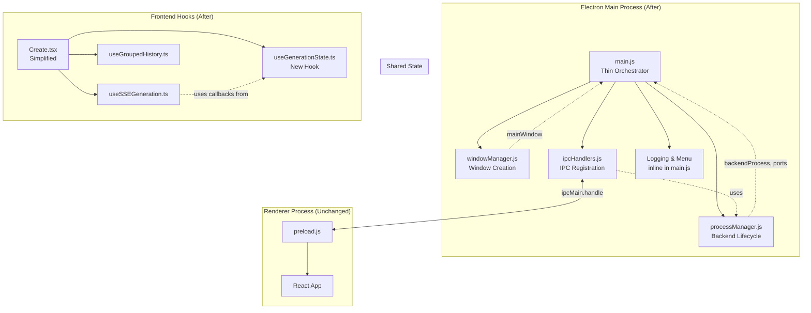
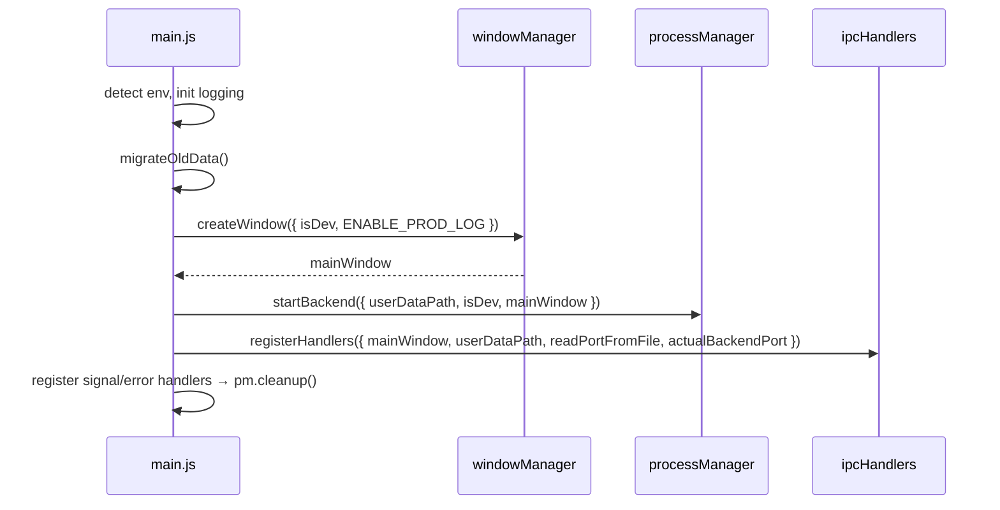

# Design Document: Code Structure Refactor

## Overview

This design decomposes two monolithic files — `electron/main.js` (1287 lines) and `frontend/src/views/Create.tsx` (1022 lines) — into well-bounded modules. The Electron main process is split into three focused modules (`processManager.js`, `windowManager.js`, `ipcHandlers.js`) orchestrated by a thin `main.js`. The React Create view's generation state is extracted into a `useGenerationState` hook following existing hook conventions.

The refactor is purely structural: no new features, no API changes, no behavioral differences. The preload bridge, IPC channels, and all user-facing behavior remain identical.

## Architecture



### Module Dependency Flow



## Components and Interfaces

### 1. processManager.js

Encapsulates all Go backend lifecycle management. Accepts configuration via function parameters instead of module-level globals.

```javascript
// electron/processManager.js

/**
 * @param {Object} config
 * @param {string} config.userDataPath - User data directory
 * @param {boolean} config.isDev - Development mode flag
 * @param {BrowserWindow} config.mainWindow - Main window reference for IPC events
 * @returns {Object} Process manager API
 */
function createProcessManager(config) {
  let backendProcess = null;
  let isCleaningUp = false;
  let cleanupComplete = false;
  let healthCheckComplete = false;
  let actualBackendPort = DEFAULT_BACKEND_PORT;

  return {
    startBackend,       // Spawn backend, configure env, attach listeners, start health check
    cleanup,            // Platform-appropriate process termination + temp file cleanup
    getBackendPath,     // Resolve backend executable path
    validateBackendPath,// Verify executable exists
    ensureDirectories,  // Create output/uploads/db/temp/logs dirs
    checkBackendHealth, // HTTP health check with retry logic
    readPortFromFile,   // Read actual port from temp file
    getPortFilePath,    // Get port file path
    getActualPort,      // Get current backend port
  };
}

module.exports = { createProcessManager };
```

### 2. windowManager.js

Encapsulates BrowserWindow creation and configuration.

```javascript
// electron/windowManager.js

/**
 * @param {Object} config
 * @param {boolean} config.isDev - Development mode flag
 * @param {boolean} config.ENABLE_PROD_LOG - Production logging flag
 * @param {Function} config.createChineseMenu - Menu builder function
 * @returns {BrowserWindow} The created main window
 */
function createWindow(config) {
  // Sets menu, creates BrowserWindow with 1400x900, context isolation,
  // preload script, icon. Loads Vite dev server or packaged index.html.
  // Returns the window instance.
}

module.exports = { createWindow };
```

### 3. ipcHandlers.js

Centralizes all `ipcMain.handle` registrations.

```javascript
// electron/ipcHandlers.js

/**
 * @param {Object} deps
 * @param {BrowserWindow} deps.mainWindow - Main window for save dialogs
 * @param {string} deps.userDataPath - User data directory
 * @param {Function} deps.readPortFromFile - Port file reader from processManager
 * @param {Function} deps.getActualPort - Get current port from processManager
 */
function registerHandlers(deps) {
  // Registers: get-backend-url, get-app-version, get-user-data-path,
  // get-paths, save-image, get-version-info, check-update, open-download-url
}

module.exports = { registerHandlers };
```

### 4. Refactored main.js

Thin orchestration layer (~100-150 lines) that imports modules and coordinates startup.

```javascript
// electron/main.js (after refactor)
const { createProcessManager } = require('./processManager');
const { createWindow } = require('./windowManager');
const { registerHandlers } = require('./ipcHandlers');

// Retains: env detection, logging init, createChineseMenu, migrateOldData
// Delegates: process management, window creation, IPC registration

app.whenReady().then(async () => {
  // 1. Detect environment, init logging
  // 2. migrateOldData()
  // 3. createWindow()
  // 4. createProcessManager() + startBackend()
  // 5. registerHandlers()
  // 6. Register signal/error handlers → processManager.cleanup()
});
```

### 5. useGenerationState Hook

```typescript
// frontend/src/hooks/useGenerationState.ts

export interface UseGenerationStateParams {
  // No params needed — this hook is self-contained state
}

export interface UseGenerationStateResult {
  /** Pending generation tasks */
  pendingTasks: PendingTask[];
  setPendingTasks: React.Dispatch<React.SetStateAction<PendingTask[]>>;
  /** Completed batch results for current session */
  batchResults: BatchResult[];
  setBatchResults: React.Dispatch<React.SetStateAction<BatchResult[]>>;
  /** Failed generation records */
  failedGenerations: FailedGeneration[];
  setFailedGenerations: React.Dispatch<React.SetStateAction<FailedGeneration[]>>;
  /** Remove a pending task by tempId, taskId, or batchId */
  removePendingTask: (identifier: { tempId?: string; taskId?: string; batchId?: string }) => void;
  /** Update a pending task's batchId by tempId */
  updatePendingTaskBatchId: (tempId: string, batchId: string) => void;
  /** Check if a batch contains images with errors */
  batchHasFailedImages: (batch: BatchResult) => boolean;
}

export function useGenerationState(): UseGenerationStateResult {
  // useState for pendingTasks, batchResults, failedGenerations
  // useCallback for removePendingTask, updatePendingTaskBatchId, batchHasFailedImages
}
```

## Data Models

No new data models are introduced. All existing types are preserved:

| Type | Location | Usage |
|------|----------|-------|
| `PendingTask` | `useGroupedHistory.ts` | Pending generation task placeholder |
| `BatchResult` | `type/generation.ts` | Multi-image batch result |
| `FailedGeneration` | `useGroupedHistory.ts` | Failed generation record |
| `GenerationItem` | `type/generation.ts` | Unified generation lifecycle type |
| `ImageGridItem` | `type/index.ts` | Individual image in a batch grid |

### Electron Module Configuration

The process manager uses a factory pattern (`createProcessManager`) that accepts a config object, avoiding module-level globals:

```typescript
interface ProcessManagerConfig {
  userDataPath: string;
  isDev: boolean;
  mainWindow: BrowserWindow;
}
```

Constants that remain in `main.js` (shared across modules via config):
- `DEFAULT_BACKEND_PORT` (51888)
- `BACKEND_PROTOCOL` ('http')
- `MAX_PORT_ATTEMPTS` (10)
- `PORT_FILE_NAME` ('sigma-backend.port')
- `ENABLE_DEV_LOG`, `ENABLE_PROD_LOG`


## Correctness Properties

*A property is a characteristic or behavior that should hold true across all valid executions of a system — essentially, a formal statement about what the system should do. Properties serve as the bridge between human-readable specifications and machine-verifiable correctness guarantees.*

### Property 1: Process manager exports complete API

*For any* valid configuration object passed to `createProcessManager`, the returned object shall contain all required function properties: `startBackend`, `cleanup`, `getBackendPath`, `validateBackendPath`, `ensureDirectories`, `checkBackendHealth`, `readPortFromFile`, `getPortFilePath`, and `getActualPort`.

**Validates: Requirements 1.1**

### Property 2: startBackend configures correct environment variables

*For any* valid process manager config (userDataPath, isDev), when `startBackend` is called, the spawned process environment shall include `OUTPUT_DIR`, `UPLOAD_DIR`, `DB_PATH`, `PORT`, `LOG_DIR`, `AUTO_PORT_DISCOVERY`, and `PRODUCTION` with values derived from the config.

**Validates: Requirements 1.3**

### Property 3: Platform-appropriate process termination

*For any* platform value (`win32` or non-`win32`) and any running backend process, `cleanup` shall use `taskkill` on Windows and `SIGTERM`/`SIGKILL` on Unix-like systems.

**Validates: Requirements 1.4**

### Property 4: Abnormal exit triggers error notification

*For any* non-zero, non-null exit code from the backend process, the process manager shall send a `backend-error` event to the main window.

**Validates: Requirements 1.5**

### Property 5: Health check retry respects max attempts

*For any* retry count value, the health check shall retry if and only if the count is less than `maxRetries` (10). When max retries is reached, it shall send a backend-error notification.

**Validates: Requirements 1.6**

### Property 6: Cleanup is idempotent

*For any* sequence of N cleanup calls (N ≥ 1), the actual process termination and temp file cleanup logic shall execute exactly once.

**Validates: Requirements 1.7**

### Property 7: Menu DevTools visibility follows config

*For any* combination of `isDev` (boolean) and `ENABLE_PROD_LOG` (boolean), the window manager shall create the menu with `showDevTools` equal to `isDev || ENABLE_PROD_LOG`.

**Validates: Requirements 2.5**

### Property 8: IPC handler registration covers all channels

*For any* valid dependencies object, `registerHandlers` shall register handlers for exactly these channels: `get-backend-url`, `get-app-version`, `get-user-data-path`, `get-paths`, `save-image`, `get-version-info`, `check-update`, `open-download-url`.

**Validates: Requirements 3.2**

### Property 9: get-backend-url returns correct URL from port

*For any* valid port number (1–65535) read from the port file, the `get-backend-url` handler shall return `http://localhost:{port}`.

**Validates: Requirements 3.4**

### Property 10: save-image correctly identifies input format

*For any* image data string, the save-image handler shall: use base64 decoding for `data:` prefixed strings, use HTTP download for `http`/`https` prefixed strings, and use raw base64 decoding for all other strings.

**Validates: Requirements 3.5**

### Property 11: removePendingTask filters correctly

*For any* list of pending tasks and any identifier object containing one of `tempId`, `taskId`, or `batchId`, calling `removePendingTask` shall remove exactly the tasks matching that identifier and leave all others unchanged.

**Validates: Requirements 5.3**

### Property 12: updatePendingTaskBatchId updates only matching task

*For any* list of pending tasks, a `tempId`, and a new `batchId`, calling `updatePendingTaskBatchId` shall update the `batchId` of exactly the task with matching `id === tempId` and leave all other tasks unchanged.

**Validates: Requirements 5.4**

### Property 13: batchHasFailedImages detects errors correctly

*For any* `BatchResult`, `batchHasFailedImages` shall return `true` if and only if at least one image in `batch.images` has a truthy `error` field.

**Validates: Requirements 5.5**

### Property 14: useGenerationState exports complete interface

*For any* render of the `useGenerationState` hook, the returned object shall contain all required keys: `pendingTasks`, `setPendingTasks`, `batchResults`, `setBatchResults`, `failedGenerations`, `setFailedGenerations`, `removePendingTask`, `updatePendingTaskBatchId`, `batchHasFailedImages`.

**Validates: Requirements 5.2**

## Error Handling

### Electron Modules

| Error Scenario | Handler | Behavior |
|---|---|---|
| Backend executable not found | `processManager.validateBackendPath` | Throws with path details, logged with directory listing |
| Backend process spawn failure | `backendProcess.on('error')` | Sends `backend-error` IPC to renderer |
| Backend abnormal exit | `backendProcess.on('exit')` | Sends `backend-error` IPC, shows restart dialog |
| Health check timeout/failure | `checkBackendHealth` | Retries up to 10 times (2s interval), then sends `backend-error` |
| Frontend index.html missing | `windowManager.createWindow` | Shows error dialog with path and directory listing |
| Cleanup failure | `processManager.cleanup` | Logs error, continues with remaining cleanup steps |
| Uncaught exception | `process.on('uncaughtException')` | Shows error dialog, calls cleanup, exits with code 1 |
| Unhandled rejection | `process.on('unhandledRejection')` | Logs error; only exits if message contains 'critical' |
| IPC save-image failure | `ipcHandlers` | Returns `{ success: false, error: message }` |

### React Hook

| Error Scenario | Handler | Behavior |
|---|---|---|
| Invalid identifier to removePendingTask | `removePendingTask` | No-op (returns unchanged array) |
| Empty pending tasks list | `removePendingTask` | No-op (returns empty array) |

All error handling behavior is preserved identically from the pre-refactor implementation. No new error paths are introduced.

## Testing Strategy

### Dual Testing Approach

This refactor uses both unit tests and property-based tests:

- **Unit tests**: Verify specific examples (window creation options, startup sequence order, edge cases like missing files)
- **Property tests**: Verify universal properties across generated inputs (cleanup idempotence, task filtering, port URL construction)

### Property-Based Testing Configuration

- **Library**: [fast-check](https://github.com/dubzzz/fast-check) for JavaScript/TypeScript property-based testing
- **Minimum iterations**: 100 per property test
- **Tag format**: `Feature: code-structure-refactor, Property {number}: {property_text}`
- Each correctness property is implemented by a single property-based test

### Test File Structure

| Test File | Scope | Type |
|---|---|---|
| `electron/processManager.test.js` | Process manager module | Unit + Property (Properties 1-6) |
| `electron/windowManager.test.js` | Window manager module | Unit + Property (Property 7) |
| `electron/ipcHandlers.test.js` | IPC handler module | Unit + Property (Properties 8-10) |
| `electron/main.test.js` | Orchestration (updated) | Unit (startup sequence, signal handlers) |
| `frontend/src/hooks/useGenerationState.test.ts` | Generation state hook | Unit + Property (Properties 11-14) |

### Unit Test Focus Areas

- Window creation with correct options (1400x900, context isolation, preload path)
- Dev mode loads Vite URL, production loads index.html
- Missing index.html shows error dialog (edge case)
- Startup sequence order verification
- Signal handlers delegate to cleanup
- migrateOldData called during startup
- Hook initial state is empty arrays

### Property Test Focus Areas

- Process manager API surface completeness (Property 1)
- Environment variable configuration (Property 2)
- Platform-specific cleanup (Property 3)
- Abnormal exit notification (Property 4)
- Health check retry logic (Property 5)
- Cleanup idempotence (Property 6)
- Menu DevTools flag (Property 7)
- IPC channel registration (Property 8)
- Backend URL from port (Property 9)
- Image data format detection (Property 10)
- Pending task removal filtering (Property 11)
- Pending task batchId update (Property 12)
- Batch error detection (Property 13)
- Hook interface completeness (Property 14)
