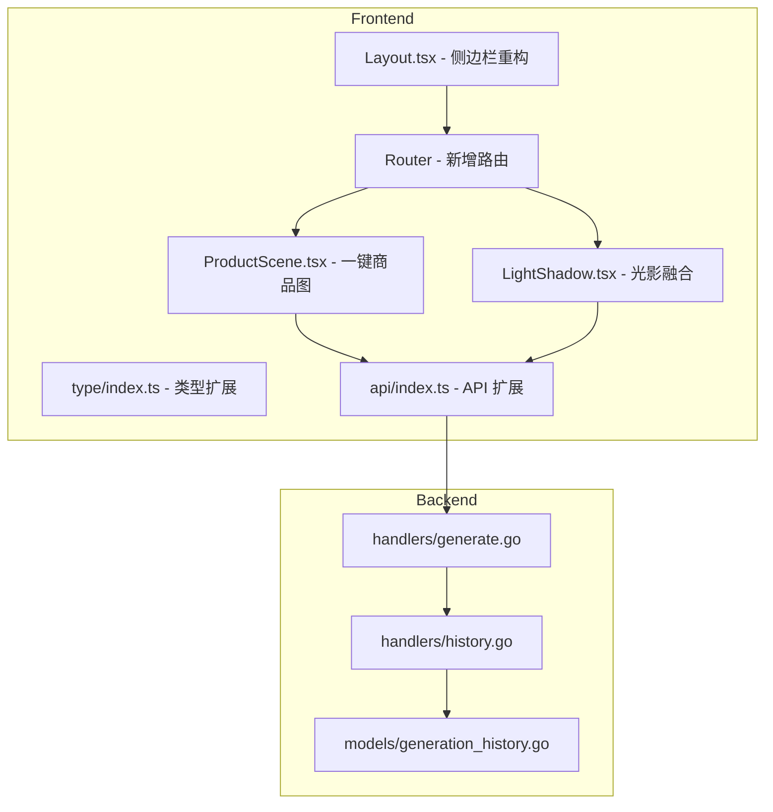
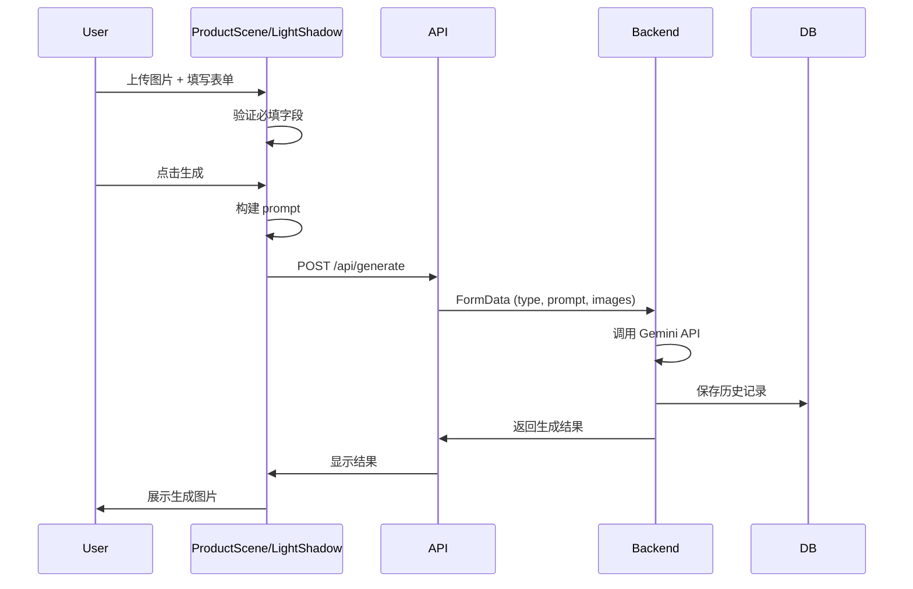

# Design Document: E-commerce Features

## Overview

本设计文档描述了为 Focus 电商图片处理应用添加两个新功能（一键商品图、光影融合）以及重构侧边栏导航的技术方案。

新功能将复用现有的组件架构和 API 模式，确保与白底图、换装等现有功能保持一致的用户体验和代码风格。

## Architecture

### 系统架构图



### 数据流



## Components and Interfaces

### 1. 前端组件

#### ProductScene.tsx (一键商品图页面)
```typescript
interface ProductSceneState {
  uploadedFile: File | null;
  productName: string;        // 产品名称（必填）
  sceneDescription: string;   // 使用场景（必填）
  generatedImage: string | null;
  isGenerating: boolean;
  history: GenerationHistory[];
}

// Prompt 构建函数
function buildProductScenePrompt(productName: string, scene: string): string {
  return `请你给图中${productName}，生成${scene}的使用场景图，需要符合透视逻辑和使用方法`;
}
```

#### LightShadow.tsx (光影融合页面)
```typescript
interface LightShadowState {
  uploadedFile: File | null;
  productName: string;        // 产品名称（必填）
  generatedImage: string | null;
  isGenerating: boolean;
  history: GenerationHistory[];
}

// Prompt 构建函数
function buildLightShadowPrompt(productName: string): string {
  return `不要改变画面中其余内容，增加${productName}的光影真实性`;
}
```

#### Layout.tsx (侧边栏重构)
```typescript
interface EcommerceSubmenu {
  isOpen: boolean;
  items: {
    path: string;
    label: string;
    icon: React.ComponentType;
  }[];
}

// 电商处理子菜单配置
const ecommerceItems = [
  { path: '/white-background', label: '白底图', icon: ImageIcon },
  { path: '/clothing-change', label: '换装', icon: Shirt },
  { path: '/product-scene', label: '商品图', icon: Package },
  { path: '/light-shadow', label: '光影', icon: Sun },
];
```

### 2. 类型扩展

```typescript
// frontend/src/type/index.ts
export const GenerationType = {
  CREATE: 'create',
  WHITE_BACKGROUND: 'white_background',
  CLOTHING_CHANGE: 'clothing_change',
  PRODUCT_SCENE: 'product_scene',      // 新增
  LIGHT_SHADOW: 'light_shadow',        // 新增
} as const;
```

### 3. API 扩展

```typescript
// frontend/src/api/index.ts
export const api = {
  // ... 现有方法
  getProductSceneHistory: () => fetch(`${BASE_URL}/api/history?type=product_scene`),
  getLightShadowHistory: () => fetch(`${BASE_URL}/api/history?type=light_shadow`),
};
```

### 4. 路由配置

```typescript
// frontend/src/router/index.tsx
{
  path: 'product-scene',
  element: <ProductScene />,
},
{
  path: 'light-shadow',
  element: <LightShadow />,
}
```

## Data Models

### GenerationHistory (无变更)
现有的 GenerationHistory 模型已支持 type 字段，无需修改数据结构。

### 新增 GenerationType 值
- `product_scene`: 一键商品图
- `light_shadow`: 光影融合

## Correctness Properties

*A property is a characteristic or behavior that should hold true across all valid executions of a system-essentially, a formal statement about what the system should do. Properties serve as the bridge between human-readable specifications and machine-verifiable correctness guarantees.*

### Property 1: 一键商品图输入验证
*For any* combination of productName and sceneDescription inputs, the generate button should be disabled if and only if either productName is empty/whitespace-only OR sceneDescription is empty/whitespace-only.
**Validates: Requirements 1.2**

### Property 2: 一键商品图 Prompt 构建
*For any* non-empty productName and sceneDescription, the constructed prompt should exactly match the template `请你给图中${productName}，生成${sceneDescription}的使用场景图，需要符合透视逻辑和使用方法`.
**Validates: Requirements 1.3**

### Property 3: 光影融合输入验证
*For any* productName input, the generate button should be disabled if and only if productName is empty/whitespace-only.
**Validates: Requirements 2.2**

### Property 4: 光影融合 Prompt 构建
*For any* non-empty productName, the constructed prompt should exactly match the template `不要改变画面中其余内容，增加${productName}的光影真实性`.
**Validates: Requirements 2.3**

### Property 5: 电商处理菜单高亮
*For any* current route path, the e-commerce menu should be highlighted if and only if the path starts with one of: `/white-background`, `/clothing-change`, `/product-scene`, `/light-shadow`.
**Validates: Requirements 3.4**

## Error Handling

### 输入验证错误
- 产品名称为空：显示 "请输入产品名称" 提示
- 使用场景为空（一键商品图）：显示 "请输入使用场景" 提示
- 未上传图片：显示 "请先上传产品图片" 提示

### API 错误
- 复用现有的 `getErrorMessage` 工具函数
- 配额超限：显示 QuotaErrorAlert 组件
- 网络错误：显示 toast 错误提示

### 任务恢复
- 复用现有的 `useTaskRecovery` hook
- 页面刷新后自动恢复进行中的任务

## Testing Strategy

### 单元测试
- 测试 prompt 构建函数的正确性
- 测试输入验证逻辑
- 测试菜单高亮逻辑

### 属性测试
使用 fast-check 库进行属性测试：

1. **Prompt 构建属性测试**
   - 生成随机的产品名称和场景描述
   - 验证构建的 prompt 符合模板格式
   - 验证 prompt 包含输入的产品名称和场景

2. **输入验证属性测试**
   - 生成随机的输入组合（空字符串、空白字符串、有效字符串）
   - 验证按钮禁用状态与输入有效性的对应关系

3. **菜单高亮属性测试**
   - 生成随机的路由路径
   - 验证高亮状态与路径匹配规则的一致性

### 测试框架配置
- 使用 Vitest 作为测试运行器
- 使用 fast-check 进行属性测试
- 每个属性测试运行至少 100 次迭代
