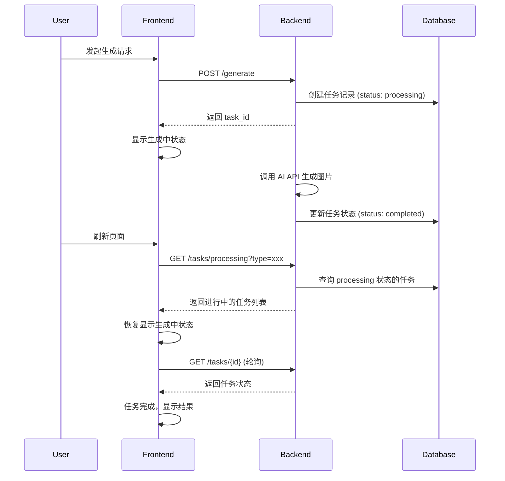

# Design Document: Generation Task Persistence

## Overview

本设计实现图片生成任务的持久化和恢复机制，确保用户在页面切换或刷新时不会丢失正在进行的生成任务。核心思路是：

1. 后端在开始生成前创建任务记录，生成完成后更新状态
2. 前端在页面加载时查询正在进行的任务，恢复显示
3. 前端通过轮询机制监控任务状态变化

## Architecture



## Components and Interfaces

### Backend Components

#### 1. GenerationTask Model (新增)

```go
// models/generation_task.go
type TaskStatus string

const (
    TaskStatusProcessing TaskStatus = "processing"
    TaskStatusCompleted  TaskStatus = "completed"
    TaskStatusFailed     TaskStatus = "failed"
)

type GenerationTask struct {
    gorm.Model
    TaskID     string     `json:"task_id" gorm:"uniqueIndex"`
    Status     TaskStatus `json:"status" gorm:"default:processing"`
    Type       string     `json:"type"`                    // create, white_background, clothing_change
    Prompt     string     `json:"prompt"`
    RefImages  string     `json:"ref_images"`              // JSON array of ref image URLs
    ImageURL   string     `json:"image_url"`               // 生成的图片 URL
    ErrorMsg   string     `json:"error_msg"`               // 错误信息
    StartedAt  time.Time  `json:"started_at"`
}
```

#### 2. Task Handler (新增)

```go
// handlers/task.go

// GetProcessingTasks 获取正在处理的任务
// GET /tasks/processing?type=create
func GetProcessingTasks(c *gin.Context) {}

// GetTaskStatus 获取单个任务状态
// GET /tasks/:id
func GetTaskStatus(c *gin.Context) {}
```

#### 3. Modified Generate Handler

修改现有的 `GenerateHandler`，在生成前创建任务记录，生成后更新状态。

### Frontend Components

#### 1. Task Recovery Hook (新增)

```typescript
// hooks/useTaskRecovery.ts
interface UseTaskRecoveryOptions {
  type: GenerationType;
  onTaskComplete: (task: GenerationTask) => void;
  onTaskFailed: (task: GenerationTask) => void;
}

function useTaskRecovery(options: UseTaskRecoveryOptions): {
  processingTasks: GenerationTask[];
  isRecovering: boolean;
}
```

#### 2. API Extensions

```typescript
// api/index.ts (扩展)
export const api = {
  // ... existing methods
  
  // 获取正在处理的任务
  async getProcessingTasks(type: string): Promise<Response>;
  
  // 获取单个任务状态
  async getTaskStatus(taskId: string): Promise<Response>;
}
```

## Data Models

### GenerationTask Table

| Field      | Type      | Description                |
|------------|-----------|----------------------------|
| id         | uint      | 主键                       |
| task_id    | string    | 唯一任务标识 (UUID)        |
| status     | string    | processing/completed/failed |
| type       | string    | 生成类型                   |
| prompt     | string    | 提示词                     |
| ref_images | string    | 参考图 JSON 数组           |
| image_url  | string    | 生成的图片 URL             |
| error_msg  | string    | 错误信息                   |
| started_at | timestamp | 任务开始时间               |
| created_at | timestamp | 创建时间                   |
| updated_at | timestamp | 更新时间                   |

## Correctness Properties

*A property is a characteristic or behavior that should hold true across all valid executions of a system-essentially, a formal statement about what the system should do. Properties serve as the bridge between human-readable specifications and machine-verifiable correctness guarantees.*

### Property 1: Task Creation Invariant
*For any* valid generation request, when the generate endpoint is called, a task record SHALL be created with status "processing" before the AI API is invoked.
**Validates: Requirements 1.1**

### Property 2: Task Completion State Transition
*For any* task that completes successfully, the task status SHALL transition from "processing" to "completed" and the image_url field SHALL be non-empty.
**Validates: Requirements 1.2**

### Property 3: Task Failure State Transition
*For any* task that fails, the task status SHALL transition from "processing" to "failed" and the error_msg field SHALL be non-empty.
**Validates: Requirements 1.3**

### Property 4: Processing Task Recovery
*For any* page load, querying for processing tasks SHALL return all tasks with status "processing" that match the specified generation type.
**Validates: Requirements 1.4, 4.2**

### Property 5: Polling Termination on Completion
*For any* task being polled, when the task status changes to "completed" or "failed", the polling SHALL stop.
**Validates: Requirements 2.3, 2.4**

### Property 6: Task Timeout Cleanup
*For any* task that has been in "processing" status for more than 5 minutes, the task SHALL be marked as "failed" with a timeout error message.
**Validates: Requirements 3.1, 3.2**

### Property 7: Task Type Association
*For any* created task, the type field SHALL match the generation type specified in the request (CREATE, WHITE_BACKGROUND, or CLOTHING_CHANGE).
**Validates: Requirements 4.1**

### Property 8: Task Data Integrity
*For any* recovered task, the prompt and ref_images fields SHALL contain the original values from the generation request.
**Validates: Requirements 4.3**

## Error Handling

### Backend Error Handling

1. **AI API Timeout**: 如果 AI API 调用超时（120秒），更新任务状态为 failed
2. **AI API Error**: 如果 AI API 返回错误，记录错误信息并更新任务状态
3. **Database Error**: 如果数据库操作失败，返回 500 错误

### Frontend Error Handling

1. **Network Error**: 轮询失败时，使用指数退避重试
2. **Task Not Found**: 如果任务不存在，停止轮询并显示错误
3. **Timeout**: 如果轮询超过 5 分钟，停止轮询并显示超时错误

## Testing Strategy

### Property-Based Testing

使用 Go 的 `testing/quick` 包进行后端属性测试，使用 `fast-check` 进行前端属性测试。

**Backend (Go)**:
- 测试任务创建、状态转换、超时清理等属性
- 每个属性测试运行至少 100 次迭代

**Frontend (TypeScript)**:
- 测试轮询逻辑、状态恢复等属性
- 使用 `fast-check` 库

### Unit Tests

1. **Backend Unit Tests**:
   - Task model CRUD operations
   - Task status transitions
   - Timeout cleanup logic

2. **Frontend Unit Tests**:
   - useTaskRecovery hook behavior
   - Polling mechanism
   - State recovery logic
