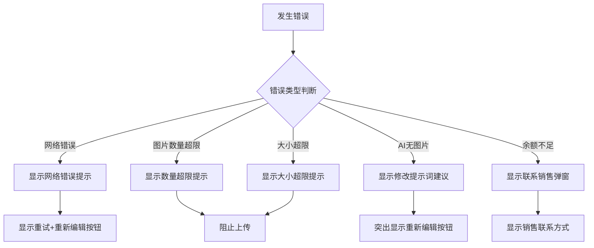

# Design Document: Image Upload Optimization

## Overview

本设计文档描述图片上传优化功能的技术实现方案。该功能旨在通过前端图片压缩减少上传数据量，优化错误提示体验，并提供失败后的重新编辑能力。

主要技术方案：
1. 使用 Canvas API 进行客户端图片压缩
2. 统一错误处理和中文友好提示
3. 增强失败状态的用户交互
4. 提供开发测试模拟开关

## Architecture

```mermaid
graph TB
    subgraph Frontend
        IU[ImageUpload Component]
        IC[ImageCompressor]
        EH[ErrorHandler]
        TS[TestSimulator]
        EC[ErrorCard]
        HFI[HistoryFailedItem]
    end
    
    subgraph Flow
        IU -->|选择图片| IC
        IC -->|压缩后| IU
        IU -->|验证大小| EH
        EH -->|错误消息| EC
        EC -->|重新编辑| IU
        TS -->|模拟错误| EH
    end
    
    subgraph API
        API[api/index.ts]
        TS -->|注入错误| API
    end
```

## Components and Interfaces

### 1. ImageCompressor 模块

新建 `frontend/src/utils/imageCompressor.ts`

```typescript
/**
 * 图片压缩配置
 */
interface CompressOptions {
  quality: number;        // 压缩质量，固定 0.92
  maxTotalSize: number;   // 最大总大小，25MB
  maxCount: number;       // 最大图片数量，5张
}

/**
 * 压缩结果
 */
interface CompressResult {
  success: boolean;
  files: File[];
  totalSize: number;
  error?: string;
}

/**
 * 压缩单张图片
 * @param file 原始文件
 * @returns 压缩后的文件（如果压缩后更大则返回原文件）
 */
async function compressImage(file: File): Promise<File>;

/**
 * 批量压缩图片
 * @param files 原始文件数组
 * @returns 压缩结果
 */
async function compressImages(files: File[]): Promise<CompressResult>;

/**
 * 验证图片数量
 * @param count 图片数量
 * @returns 是否有效
 */
function validateImageCount(count: number): boolean;

/**
 * 验证总大小
 * @param totalSize 总大小（字节）
 * @returns 是否有效
 */
function validateTotalSize(totalSize: number): boolean;
```

### 2. ErrorHandler 模块更新

修改 `frontend/src/utils/errorHandler.ts`

```typescript
/**
 * 更新后的错误消息常量
 */
const ERROR_MESSAGES = {
  NETWORK_ERROR: '网络出了点小差，请稍后重试',
  IMAGE_COUNT_EXCEEDED: '最多支持上传 5 张参考图',
  IMAGE_SIZE_EXCEEDED: '图片总大小过大，请减少图片数量或选择较小的图片',
  NO_IMAGE_RETURNED: '未能生成图片，请尝试修改提示词后重试',
  QUOTA_EXHAUSTED: '余额不足请联系销售充值',
};

/**
 * 用户操作建议
 */
type UserAction = 
  | 'retry'           // 重试
  | 'edit_prompt'     // 修改提示词
  | 'reduce_images'   // 减少图片
  | 'contact_sales';  // 联系销售

/**
 * 解析后的错误接口（扩展）
 */
interface ParsedError {
  message: string;
  isQuotaError: boolean;
  isNoImageError: boolean;
  statusCode?: number;
  userAction: UserAction;
  suggestEdit?: boolean;  // 是否建议修改提示词
}
```

### 3. ErrorCard 组件更新

修改 `frontend/src/components/feedback/error-card.tsx`

```typescript
interface ErrorCardProps {
  errorMessage: string;
  prompt?: string;
  onRetry?: () => void;
  onEdit?: () => void;      // 新增：重新编辑回调
  disabled?: boolean;
  suggestEdit?: boolean;    // 新增：是否突出显示编辑建议
}
```

### 4. TestSimulator 配置

修改 `frontend/src/api/index.ts`

```typescript
/**
 * 测试模拟配置
 */
interface SimulatorConfig {
  enabled: boolean;
  errorType: 'network' | 'count_exceeded' | 'size_exceeded' | 'no_image' | 'quota' | null;
}

// 默认配置（生产环境禁用）
const SIMULATOR_CONFIG: SimulatorConfig = {
  enabled: false,
  errorType: null,
};
```

## Data Models

### 压缩配置常量

```typescript
const COMPRESS_CONFIG = {
  QUALITY: 0.92,              // 压缩质量（视觉无损）
  MAX_TOTAL_SIZE: 25 * 1024 * 1024,  // 25MB
  MAX_COUNT: 5,               // 最大图片数量
} as const;
```

### 错误类型枚举

```typescript
enum ErrorType {
  NETWORK = 'network',
  COUNT_EXCEEDED = 'count_exceeded',
  SIZE_EXCEEDED = 'size_exceeded',
  NO_IMAGE = 'no_image',
  QUOTA = 'quota',
}
```

## Correctness Properties

*A property is a characteristic or behavior that should hold true across all valid executions of a system—essentially, a formal statement about what the system should do. Properties serve as the bridge between human-readable specifications and machine-verifiable correctness guarantees.*

### Property 1: Image Count Limit Validation

*For any* set of images with count N, if N > 5, the validation SHALL reject the upload and return an error.

**Validates: Requirements 1.1, 2.2**

### Property 2: Compression Behavior

*For any* image file:
- If the file is JPEG, compression SHALL use quality 0.92
- If the file is PNG, the output SHALL remain PNG format
- If the compressed size > original size, the original file SHALL be returned

**Validates: Requirements 1.2, 1.3, 1.4**

### Property 3: Total Size Validation

*For any* set of compressed images with total size S, if S > 25MB, the validation SHALL reject the upload and display the message "图片总大小过大，请减少图片数量或选择较小的图片".

**Validates: Requirements 1.5, 1.6, 2.3**

### Property 4: Error Message Mapping

*For any* error type:
- Network/timeout errors → "网络出了点小差，请稍后重试"
- AI no image errors → "未能生成图片，请尝试修改提示词后重试"
- Quota errors → "余额不足请联系销售充值"

**Validates: Requirements 2.1, 2.4, 2.5**

### Property 5: Action Button Behavior

*For any* failed generation:
- Clicking "重试" SHALL trigger generation with the same prompt, reference images, and settings
- Clicking "重新编辑" SHALL populate the input fields with the original prompt and reference images

**Validates: Requirements 3.4, 3.5**

## Error Handling

### 错误分类和处理策略

| 错误类型 | 错误消息 | 用户操作 | UI 行为 |
|---------|---------|---------|--------|
| 网络超时/上传失败 | 网络出了点小差，请稍后重试 | 重试 | 显示重试按钮 |
| 图片数量超限 | 最多支持上传 5 张参考图 | 减少图片 | 阻止上传，提示用户 |
| 压缩后仍超 25MB | 图片总大小过大，请减少图片数量或选择较小的图片 | 减少图片 | 阻止上传，提示用户 |
| AI 未返回图片 | 未能生成图片，请尝试修改提示词后重试 | 修改提示词 | 突出显示"重新编辑"按钮 |
| 余额不足 | 余额不足请联系销售充值 | 联系销售 | 显示联系销售弹窗 |

### 错误处理流程



## Testing Strategy

### 单元测试

1. **ImageCompressor 测试**
   - 测试 JPEG 压缩质量设置
   - 测试 PNG 格式保持
   - 测试压缩后大小比较逻辑
   - 测试图片数量验证
   - 测试总大小验证

2. **ErrorHandler 测试**
   - 测试各种错误类型的消息映射
   - 测试 userAction 返回值
   - 测试 suggestEdit 标志

3. **ErrorCard 组件测试**
   - 测试重试按钮点击
   - 测试重新编辑按钮点击
   - 测试 suggestEdit 样式

### 属性测试

使用 fast-check 进行属性测试：

1. **Property 1: Image Count Limit**
   - 生成随机数量的图片（1-10张）
   - 验证 >5 张时返回错误
   - **Feature: image-upload-optimization, Property 1: Image count limit validation**

2. **Property 2: Compression Behavior**
   - 生成随机 JPEG/PNG 图片
   - 验证压缩行为符合规范
   - **Feature: image-upload-optimization, Property 2: Compression behavior**

3. **Property 3: Total Size Validation**
   - 生成随机大小的图片集合
   - 验证 25MB 阈值判断
   - **Feature: image-upload-optimization, Property 3: Total size validation**

4. **Property 4: Error Message Mapping**
   - 生成随机错误类型
   - 验证消息映射正确
   - **Feature: image-upload-optimization, Property 4: Error message mapping**

5. **Property 5: Action Button Behavior**
   - 生成随机的失败状态
   - 验证重试和编辑行为
   - **Feature: image-upload-optimization, Property 5: Action button behavior**

### 测试配置

- 属性测试最少运行 100 次迭代
- 使用 fast-check 库进行属性测试
- 每个属性测试需要标注对应的设计文档属性编号
