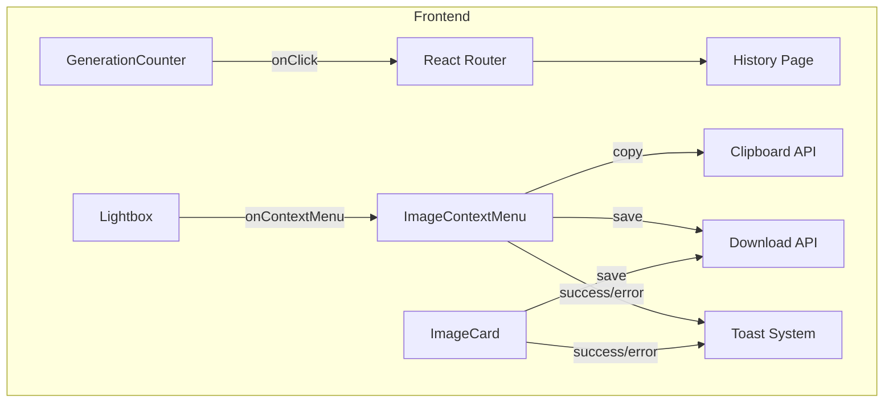

# Design Document

## Overview

本设计文档描述了两个用户体验增强功能的实现方案：
1. GenerationCounter 点击跳转功能 - 使生成计数器可点击，跳转到历史记录页面
2. Lightbox 右键菜单功能 - 在图片放大查看时支持右键复制/保存图片
3. Toast 消息统一 - 将所有图片保存成功的消息统一为"图片保存成功"

## Architecture



## Components and Interfaces

### 1. GenerationCounter 组件增强

现有组件位置：`frontend/src/components/GenerationCounter.tsx`

修改内容：
- 添加 `useNavigate` hook 实现路由跳转
- 添加 `onClick` 事件处理，跳转到 `/history`
- 添加 `cursor-pointer` 样式
- 添加 `hover:bg-gray-100` 悬停效果

```typescript
interface GenerationCounterProps {
  className?: string;
  refreshTrigger?: number;
}
```

### 2. Lightbox 组件增强

现有组件位置：`frontend/src/components/Lightbox.tsx`

修改内容：
- 添加右键菜单状态管理
- 添加 `onContextMenu` 事件处理
- 集成 `ImageContextMenu` 组件
- 阻止默认浏览器右键菜单

```typescript
interface LightboxProps {
  imageUrl: string | null;
  onClose: () => void;
}

// 新增状态
const [contextMenuPosition, setContextMenuPosition] = useState<{ x: number; y: number } | null>(null);
```

### 3. ImageContextMenu 组件

现有组件位置：`frontend/src/components/ImageContextMenu.tsx`

修改内容：
- 将"图片下载成功"改为"图片保存成功"

### 4. ImageCard 组件

现有组件位置：`frontend/src/components/ImageCard.tsx`

修改内容：
- 将"图片下载成功"改为"图片保存成功"

## Data Models

无新增数据模型，复用现有组件状态。


## Correctness Properties

*A property is a characteristic or behavior that should hold true across all valid executions of a system-essentially, a formal statement about what the system should do. Properties serve as the bridge between human-readable specifications and machine-verifiable correctness guarantees.*

基于预分析，大部分需求是 UI 交互的具体示例测试，没有需要属性测试的通用属性。所有测试用例都是针对特定交互的示例测试。

**Property Reflection:**
- 需求 3.1、3.2、3.3 可以合并为一个统一的测试：验证所有保存操作显示相同的成功消息
- 需求 2.4 和 3.4 是边缘情况的错误处理

由于本功能主要是 UI 交互增强，没有复杂的数据转换或业务逻辑，因此不需要属性测试。所有验证通过单元测试和示例测试完成。

## Error Handling

### 图片复制失败
- 场景：Clipboard API 不可用或权限被拒绝
- 处理：显示错误 Toast "复制失败，请稍后重试"

### 图片保存失败
- 场景：网络错误或文件系统错误
- 处理：显示错误 Toast "保存失败，请稍后重试"

### 导航失败
- 场景：路由配置错误（极少发生）
- 处理：React Router 内部处理

## Testing Strategy

### 单元测试

由于本功能主要是 UI 交互，使用单元测试验证：

1. **GenerationCounter 测试**
   - 验证点击触发导航到 `/history`
   - 验证组件包含 `cursor-pointer` 类

2. **Lightbox 测试**
   - 验证右键点击显示上下文菜单
   - 验证点击外部关闭菜单
   - 验证 Escape 键关闭菜单

3. **Toast 消息一致性测试**
   - 验证 ImageContextMenu 保存成功显示"图片保存成功"
   - 验证 ImageCard 保存成功显示"图片保存成功"

### 测试框架

- 使用 Vitest 作为测试框架
- 使用 @testing-library/react 进行组件测试
