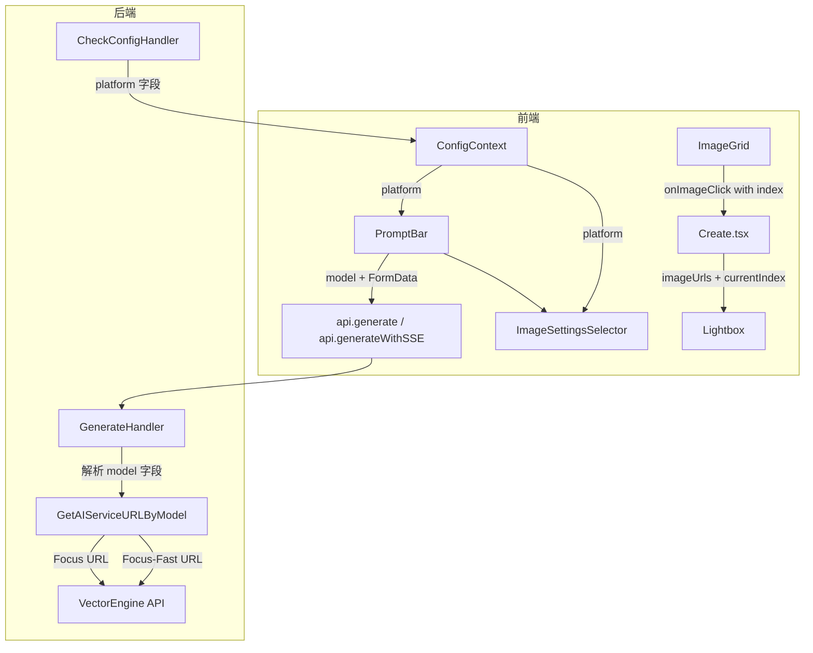

# 设计文档：Lightbox 导航与模型选择

## 概述

本设计涵盖两个核心功能模块：

1. **Lightbox 批次导航**：扩展现有 Lightbox 组件，支持在同一批次的多张图片之间通过键盘方向键循环切换，切换时重置缩放和拖拽状态。
2. **模型选择器（Focus / Focus-Fast）**：在 PromptBar 中新增模型选择 UI，仅在 VectorEngine 平台下显示。Focus-Fast 模型支持额外的极端宽高比（1:4、4:1、1:8、8:1）。前端通过 FormData 传递 `model` 字段，后端根据该字段选择对应的 API URL。

设计原则：最小化改动范围，复用现有架构模式，保持向后兼容。

## 架构

### 整体数据流



### 变更范围

| 层级 | 文件 | 变更类型 |
|------|------|----------|
| 前端 - 组件 | `Lightbox.tsx` | 修改 props 接口，新增导航逻辑 |
| 前端 - 组件 | `ImageGrid.tsx` | 修改 `onImageClick` 回调签名 |
| 前端 - 组件 | `PromptBar.tsx` | 新增模型选择器 UI，FormData 添加 `model` 字段 |
| 前端 - 组件 | `ImageSettingsSelector.tsx` | 根据模型动态显示宽高比选项 |
| 前端 - 视图 | `Create.tsx` | `lightboxImage` 状态改为 `{urls, index}` 结构 |
| 前端 - 上下文 | `ConfigContext.tsx` | 新增 `platform` 状态字段 |
| 前端 - 类型 | `type/index.ts` | 扩展 `AspectRatio` 类型，新增 `ModelType` 类型 |
| 后端 - 配置 | `config/config.go` | 新增 Focus-Fast URL 常量和获取函数 |
| 后端 - 处理器 | `handlers/config.go` | `CheckConfigHandler` 响应添加 `platform` 字段 |
| 后端 - 处理器 | `handlers/generate.go` | 解析 `model` 字段，选择对应 API URL |

## 组件与接口

### 1. Lightbox 组件接口变更

```typescript
// 旧接口
interface LightboxProps {
  imageUrl: string | null;
  onClose: () => void;
}

// 新接口
interface LightboxProps {
  imageUrl: string | null;       // 单图模式（向后兼容）
  imageUrls?: string[];          // 批次模式：所有图片 URL 列表
  currentIndex?: number;         // 批次模式：当前图片索引
  onClose: () => void;
}
```

**导航逻辑**：
- 当 `imageUrls` 存在且长度 > 1 时启用批次导航模式
- ArrowRight：`currentIndex = (currentIndex + 1) % imageUrls.length`（循环）
- ArrowLeft：`currentIndex = (currentIndex - 1 + imageUrls.length) % imageUrls.length`（循环）
- 切换时重置 `zoom = 1`，`position = {x: 0, y: 0}`
- 单图模式（`imageUrls` 未提供或长度 ≤ 1）：方向键无效果

**内部状态管理**：
- 新增 `activeIndex` 内部状态，初始值为 `currentIndex`
- 当 `currentIndex` prop 变化时同步更新 `activeIndex`
- 显示的图片 URL：`imageUrls?.[activeIndex] ?? imageUrl`

### 2. ImageGrid 回调变更

```typescript
// 旧接口
onImageClick: (url: string) => void;

// 新接口
onImageClick: (url: string, batchUrls?: string[], indexInBatch?: number) => void;
```

`GridImageCard` 在点击时传递当前批次的所有成功图片 URL 列表和当前图片在列表中的索引。

### 3. Create.tsx 状态变更

```typescript
// 旧状态
const [lightboxImage, setLightboxImage] = useState<string | null>(null);

// 新状态
const [lightboxData, setLightboxData] = useState<{
  url: string | null;
  urls?: string[];
  index?: number;
} | null>(null);
```

`onImageClick` 回调更新为接收批次信息并传递给 Lightbox。

### 4. 模型选择器

**新增类型**：

```typescript
export type ModelType = 'focus' | 'focus-fast';
```

**PromptBar 新增 props**：

```typescript
interface PromptBarProps {
  // ... 现有 props
  platform?: string;  // 当前 API 平台类型
}
```

**PromptBar 内部状态**：

```typescript
const [model, setModel] = useState<ModelType>('focus');
```

**模型选择器 UI**：
- 位置：PromptBar 内部，设置按钮旁边
- 样式：紧凑的切换按钮组（类似 SegmentedControl）
- 显示条件：`platform === 'vectorengine'`
- 选项：`Focus 1x` | `Focus-Fast 0.5x`

**平台切换逻辑**：
- 当 `platform` 从 `vectorengine` 变为 `aiaimi` 时，自动将 `model` 重置为 `'focus'`

### 5. ImageSettingsSelector 宽高比扩展

```typescript
// 新增 props
interface ImageSettingsSelectorProps {
  // ... 现有 props
  model?: ModelType;  // 当前选中的模型
}
```

**宽高比配置**：

```typescript
// 基础宽高比（Focus 和 Focus-Fast 共用）
const baseAspectRatios = ['21:9', '16:9', '3:2', '4:3', '1:1', '3:4', '2:3', '9:16', '9:21'];

// Focus-Fast 专属宽高比
const focusFastExtraRatios = ['1:4', '4:1', '1:8', '8:1'];
```

**切换逻辑**：
- 当 `model` 从 `'focus-fast'` 切换为 `'focus'` 时，如果当前选中的宽高比属于 `focusFastExtraRatios`，自动重置为 `'1:1'`

### 6. ConfigContext 扩展

```typescript
interface ConfigContextType {
  // ... 现有字段
  platform: string;  // 'vectorengine' | 'aiaimi' | 'unknown'
}
```

从 `checkConfig` 响应中读取 `platform` 字段并存储。

### 7. 后端 CheckConfigHandler 变更

响应 JSON 新增 `platform` 字段：

```go
c.JSON(200, gin.H{
    // ... 现有字段
    "platform": string(config.GetAPIPlatform()),
})
```

### 8. 后端模型 URL 选择

**config.go 新增**：

```go
// Focus-Fast 模型 URL（base64 编码）
// https://api.vectorengine.ai/v1beta/models/gemini-3.1-flash-image-preview:generateContent
var focusFastServiceConfig = ServiceConfig{
    APIURL: decodeConfig("aHR0cHM6Ly9hcGkudmVjdG9yZW5naW5lLmFpL3YxYmV0YS9tb2RlbHMvZ2VtaW5pLTMuMS1mbGFzaC1pbWFnZS1wcmV2aWV3OmdlbmVyYXRlQ29udGVudA=="),
}

// GetAIServiceURLByModel 根据模型名称获取 API URL
func GetAIServiceURLByModel(model string) string {
    platform := GetAPIPlatform()
    // Aiaimi 平台不支持 Focus-Fast，始终使用默认 URL
    if platform == PlatformAiaimi {
        return AiaimiServiceURL
    }
    // VectorEngine 平台根据 model 参数选择
    if model == "focus-fast" {
        return focusFastServiceConfig.APIURL
    }
    // 默认使用 Focus 模型
    return AIServiceURL
}
```

**generate.go 变更**：

```go
// 解析 model 参数
model := c.PostForm("model")
if model == "" {
    model = "focus"  // 默认 Focus
}

// 替换 config.GetCurrentAIServiceURL() 为 config.GetAIServiceURLByModel(model)
apiURL := config.GetAIServiceURLByModel(model)
```

### 9. FormData 传递

PromptBar 在构建 FormData 时新增：

```typescript
formData.append('model', model);  // 'focus' 或 'focus-fast'
```

## 数据模型

### 前端类型变更

```typescript
// type/index.ts 扩展
export type ModelType = 'focus' | 'focus-fast';

// AspectRatio 扩展（新增 Focus-Fast 专属比例）
export type AspectRatio = 
  | '21:9' | '16:9' | '3:2' | '4:3' | '1:1' 
  | '3:4' | '2:3' | '9:16' | '9:21'
  | '1:4' | '4:1' | '1:8' | '8:1';  // Focus-Fast 专属
```

### 后端配置变更

```go
// config.go - 新增 Focus-Fast URL 变量
var FocusFastServiceURL string  // 在 Init() 中初始化

// 敏感关键词列表扩展
// 新增: "gemini-3.1-flash", "flash-image-preview"
```

### API 接口变更

**POST /generate FormData**：

| 字段 | 类型 | 必填 | 说明 |
|------|------|------|------|
| prompt | string | 是 | 提示词 |
| aspectRatio | string | 否 | 宽高比，默认 1:1 |
| imageSize | string | 否 | 图片尺寸，默认 2K |
| count | string | 否 | 生成数量，默认 1 |
| model | string | 否 | 模型选择：`focus` 或 `focus-fast`，默认 `focus` |
| images | File[] | 否 | 参考图 |

**GET /config/check 响应**：

```json
{
  "has_api_key": true,
  "masked_key": "...",
  "platform": "vectorengine",
  // ... 其他现有字段
}
```


## 正确性属性

*属性（Property）是指在系统所有合法执行路径中都应成立的特征或行为——本质上是对系统行为的形式化陈述。属性是连接人类可读规格说明与机器可验证正确性保证之间的桥梁。*

### Property 1: 批次导航索引计算

*For any* 图片 URL 列表（长度 ≥ 1）、任意当前索引（0 ≤ index < length）、以及任意导航方向（左/右），导航后的索引应等于 `(currentIndex + delta + length) % length`，其中 delta 为右方向 +1、左方向 -1。当列表长度为 1 时，导航后索引不变。

**Validates: Requirements 1.2, 1.3, 1.4, 1.5, 1.6, 1.8**

### Property 2: 导航重置缩放与位置

*For any* 批次导航操作（切换到不同图片），操作后的缩放比例应为 1，拖拽位置应为 `{x: 0, y: 0}`。

**Validates: Requirements 1.7**

### Property 3: Lightbox 显示正确图片

*For any* 图片 URL 列表和有效索引，Lightbox 显示的图片 URL 应等于 `imageUrls[activeIndex]`。

**Validates: Requirements 1.1**

### Property 4: 模型选择器可见性

*For any* 平台类型字符串，模型选择器可见当且仅当平台为 `'vectorengine'`。

**Validates: Requirements 2.1, 2.2**

### Property 5: 平台切换重置模型

*For any* 当前模型选择（`'focus'` 或 `'focus-fast'`），当平台变为非 `'vectorengine'` 时，模型应自动重置为 `'focus'`。

**Validates: Requirements 2.4**

### Property 6: URL 选择逻辑

*For any* model 字符串和平台类型，`GetAIServiceURLByModel` 返回的 URL 应满足：当且仅当 `model === 'focus-fast'` 且平台为 VectorEngine 时返回包含 `gemini-3.1-flash-image-preview` 的 URL，其他所有情况（包括无效 model 值、空字符串、Aiaimi 平台）返回对应平台的默认 Focus URL。

**Validates: Requirements 2.5, 2.6, 5.2, 5.3**

### Property 7: 宽高比可用集合

*For any* 模型类型，当 model 为 `'focus-fast'` 时可用宽高比集合应为基础集合 ∪ {1:4, 4:1, 1:8, 8:1}；当 model 为 `'focus'` 时可用宽高比集合应恰好为基础集合，不包含 Focus-Fast 专属比例。

**Validates: Requirements 4.1, 4.2, 4.4**

### Property 8: 模型切换重置专属宽高比

*For any* Focus-Fast 专属宽高比（1:4、4:1、1:8、8:1），当模型从 `'focus-fast'` 切换为 `'focus'` 且当前选中的宽高比属于该专属集合时，宽高比应自动重置为 `'1:1'`。

**Validates: Requirements 4.3**

### Property 9: 配置响应包含平台字段

*For any* 配置状态（有/无 API Key，任意平台），`/config/check` 响应 JSON 应包含 `platform` 字段，且值为 `'vectorengine'`、`'aiaimi'` 或 `'unknown'` 之一。

**Validates: Requirements 3.1**

## 错误处理

| 场景 | 处理方式 |
|------|----------|
| `model` 字段缺失或无效 | 后端默认使用 Focus 模型（`gemini-3-pro-image-preview`） |
| Focus-Fast API 调用失败 | 与现有 Focus 错误处理逻辑一致，返回过滤后的错误信息 |
| `imageUrls` 为空数组 | Lightbox 回退到 `imageUrl` 单图模式 |
| `currentIndex` 超出范围 | 使用 `Math.max(0, Math.min(index, urls.length - 1))` 钳位 |
| 平台信息获取失败 | ConfigContext 默认 `platform = 'unknown'`，隐藏模型选择器 |
| Focus-Fast 专属宽高比传给 Focus 模型 | 后端不做校验（API 会自行处理），前端通过自动重置防止此情况 |

## 测试策略

### 双重测试方法

本功能采用单元测试 + 属性测试的双重策略：

- **单元测试**：验证具体示例、边界情况和错误条件
- **属性测试**：验证跨所有输入的通用属性

### 属性测试配置

- **库选择**：前端使用 `fast-check`，后端使用 Go 标准 `testing/quick` 或 `gopter`
- **最小迭代次数**：每个属性测试至少 100 次迭代
- **标签格式**：`Feature: lightbox-nav-and-model-selection, Property {number}: {property_text}`
- 每个正确性属性由一个属性测试实现

### 单元测试重点

- Lightbox 单图模式向后兼容性（Property 3 的具体示例）
- 模型选择器默认值为 Focus（需求 2.3 的具体示例）
- ConfigContext 存储平台信息（需求 3.2 的集成测试）
- FormData 包含 model 字段（需求 5.1 的具体示例）

### 属性测试覆盖

| 属性 | 测试描述 | 生成器 |
|------|----------|--------|
| Property 1 | 批次导航索引计算 | 随机生成 1-100 长度的 URL 列表、随机索引、随机方向 |
| Property 2 | 导航重置状态 | 随机生成批次数据和初始缩放/位置状态 |
| Property 3 | 正确图片显示 | 随机生成 URL 列表和有效索引 |
| Property 4 | 模型选择器可见性 | 随机生成平台字符串（包括有效和无效值） |
| Property 5 | 平台切换重置模型 | 随机生成模型选择和平台转换序列 |
| Property 6 | URL 选择逻辑 | 随机生成 model 字符串（包括有效、无效、空值）和平台类型 |
| Property 7 | 宽高比可用集合 | 枚举所有模型类型，验证集合关系 |
| Property 8 | 模型切换重置宽高比 | 随机选择 Focus-Fast 专属宽高比，模拟切换 |
| Property 9 | 配置响应结构 | 随机生成配置状态组合 |
