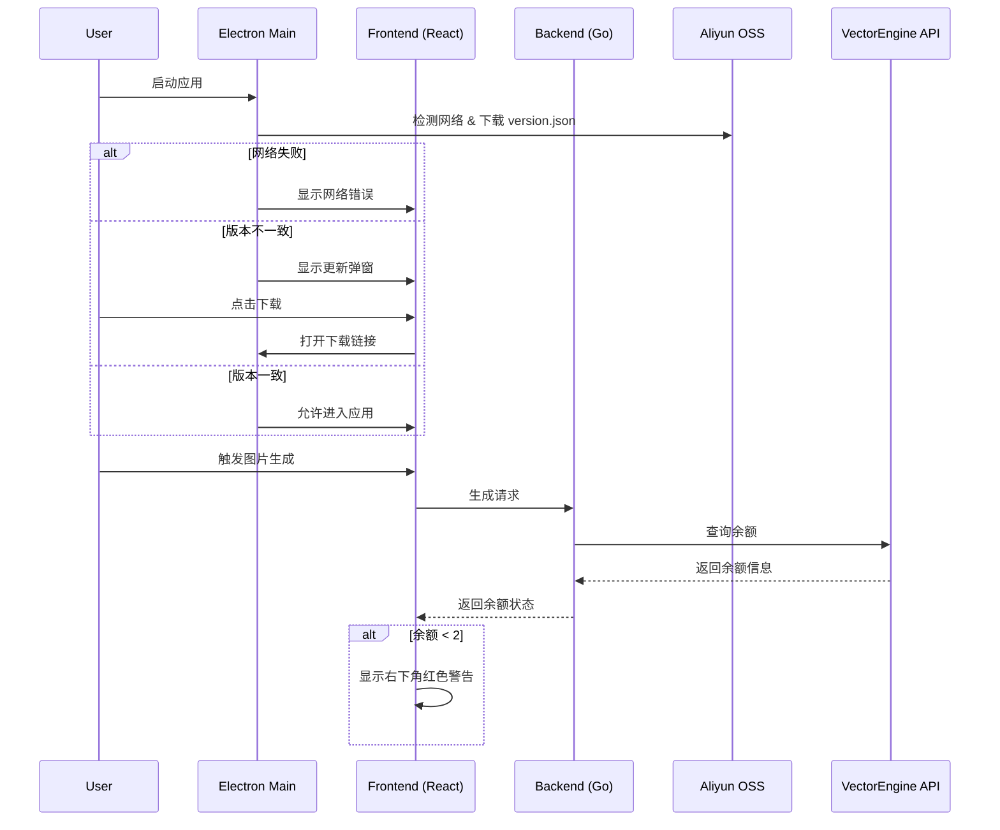

# Design Document

## Overview

本设计实现 Focus 应用的强制版本更新检查和余额监控功能。系统分为三个主要模块：

1. **版本检查模块 (Version Checker)** - 在 Electron 主进程中实现，负责网络检测、版本信息获取和比对
2. **余额检查模块 (Balance Checker)** - 在后端 Go 服务中实现，负责调用 API 查询用户余额
3. **前端 UI 组件** - 显示更新弹窗和余额警告提示

## Architecture



## Components and Interfaces

### 1. Electron 主进程 - 版本检查模块

**文件**: `electron/main.js`

**新增函数**:
- `checkNetworkConnection()`: 检测网络连接
- `fetchVersionInfo()`: 从 OSS 下载 version.json（直接在内存中处理，不保存到本地文件）
- `compareVersion(local, remote)`: 比对版本信息
- `getDownloadUrl(versionInfo)`: 根据平台获取下载链接

**版本检查流程**:
1. 从 OSS 下载 version.json 到内存（使用 HTTP GET 请求）
2. 解析 JSON 数据
3. 与本地版本比对
4. 返回结果（不在本地保存任何文件）

**新增 IPC 通道**:
- `get-version-info`: 获取本地版本信息
- `check-update`: 检查更新
- `open-download-url`: 打开下载链接

### 2. 后端 Go 服务 - 余额检查模块

**文件**: `backend/handlers/balance.go` (新建)

**API 端点**:
- `GET /api/balance`: 查询用户余额

**响应格式**:
```json
{
  "lowBalance": false
}
```

### 3. 前端组件

**新增组件**:
- `UpdateModal.tsx`: 更新提示弹窗
- `BalanceWarning.tsx`: 右下角余额警告组件

**新增 Context**:
- `VersionContext`: 管理版本检查状态
- 扩展 `ConfigContext`: 添加余额状态

## Data Models

### RemoteVersionInfo (OSS version.json)

```typescript
interface RemoteVersionInfo {
  versionCode: string;      // "202512201755"
  versionName: string;      // "1.0.2"
  updateContent: string;    // "1. 修复了xxx\n2. 新增了xxx"
  windowsUrl: string;       // Windows 下载链接
  macX64Url: string;        // Mac Intel 下载链接
  macArm64Url: string;      // Mac M芯片 下载链接
}
```

### LocalVersionInfo (package.json)

```typescript
interface LocalVersionInfo {
  versionCode: string;      // "202512201755"
  versionName: string;      // "1.0.2" (from package.json version)
}
```

### BalanceInfo

```typescript
interface BalanceInfo {
  lowBalance: boolean;      // 是否低于阈值 (余额 < 2)
}
```

### VersionCheckResult

```typescript
interface VersionCheckResult {
  status: 'network_error' | 'fetch_error' | 'update_required' | 'up_to_date';
  remoteVersion?: RemoteVersionInfo;
  downloadUrl?: string;
  errorMessage?: string;
}
```


## Correctness Properties

*A property is a characteristic or behavior that should hold true across all valid executions of a system-essentially, a formal statement about what the system should do. Properties serve as the bridge between human-readable specifications and machine-verifiable correctness guarantees.*

### Property 1: Version comparison detects any mismatch
*For any* local version (versionCode, versionName) and remote version, if either versionCode OR versionName differs, the comparison function SHALL return `update_required`.
**Validates: Requirements 3.1**

### Property 2: Download URL selection by platform
*For any* platform (win32, darwin) and architecture (x64, arm64), the download URL selector SHALL return the correct URL field from version info.
**Validates: Requirements 3.3**

### Property 3: Balance calculation accuracy
*For any* subscription data (total) and usage data (used), the balance SHALL equal total minus (used / 100).
**Validates: Requirements 4.2**

### Property 4: Low balance threshold detection
*For any* balance value, the low balance flag SHALL be true if and only if balance < 2.
**Validates: Requirements 5.1**

### Property 5: Balance warning persistence
*For any* sequence of balance checks, the warning SHALL remain visible while balance stays below threshold.
**Validates: Requirements 5.3**

## Error Handling

### 网络错误处理

1. **网络连接失败**
   - 显示: "网络连接失败，请检查网络后重试"
   - 提供重试按钮
   - 阻止进入应用

2. **version.json 下载失败**
   - 显示: "获取版本信息失败，请稍后重试"
   - 提供重试按钮
   - 阻止进入应用

3. **余额查询失败**
   - 静默处理，不影响生成流程
   - 记录日志供调试

### 超时处理

- 网络检测超时: 5秒
- version.json 下载超时: 10秒
- 余额查询超时: 5秒

## Testing Strategy

### 单元测试

1. **版本比对逻辑测试**
   - 测试 versionCode 不同的情况
   - 测试 versionName 不同的情况
   - 测试两者都相同的情况

2. **下载链接选择测试**
   - 测试 Windows 平台
   - 测试 Mac Intel 平台
   - 测试 Mac M芯片平台

3. **余额计算测试**
   - 测试正常余额计算
   - 测试边界值 (余额 = 2)
   - 测试余额为 0 的情况

### 属性测试

使用 Jest + fast-check 进行属性测试：

1. **Property 1**: 版本比对 - 生成随机版本号组合，验证比对逻辑
2. **Property 2**: 下载链接选择 - 生成随机平台/架构组合，验证选择逻辑
3. **Property 3**: 余额计算 - 生成随机 total/used 值，验证计算准确性
4. **Property 4**: 阈值检测 - 生成随机余额值，验证阈值判断

### 集成测试

1. 模拟 OSS 响应测试完整版本检查流程
2. 模拟 API 响应测试余额查询流程

## Implementation Notes

### package.json 修改

需要在根目录 `package.json` 中添加 `versionCode` 字段：

```json
{
  "name": "focus",
  "version": "1.0.2",
  "versionCode": "202512201755",
  ...
}
```

### 配置常量

```typescript
// electron/main.js
const VERSION_JSON_URL = 'https://sigma-focus.oss-cn-hangzhou.aliyuncs.com/version.json';
const BALANCE_WARNING_THRESHOLD = 2;
const API_DOMAIN = 'https://api.vectorengine.ai';
```

### 余额查询 API 调用

后端需要调用 VectorEngine API：
1. `GET /v1/dashboard/billing/subscription` - 获取总额度
2. `GET /v1/dashboard/billing/usage?start_date=2023-01-01&end_date={tomorrow}` - 获取已使用额度

余额计算: `balance = hard_limit_usd - (total_usage / 100)`
