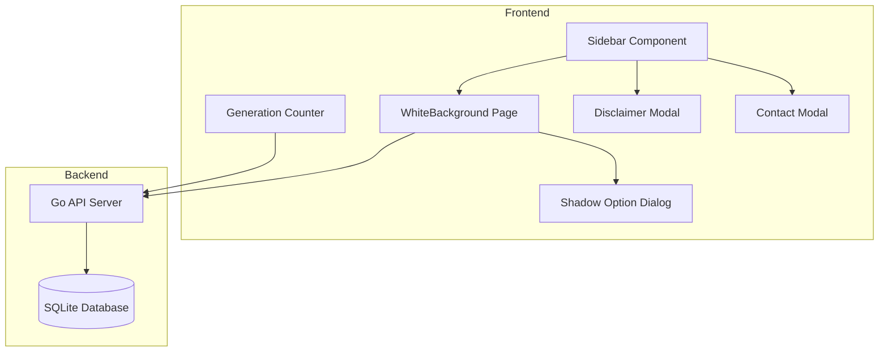
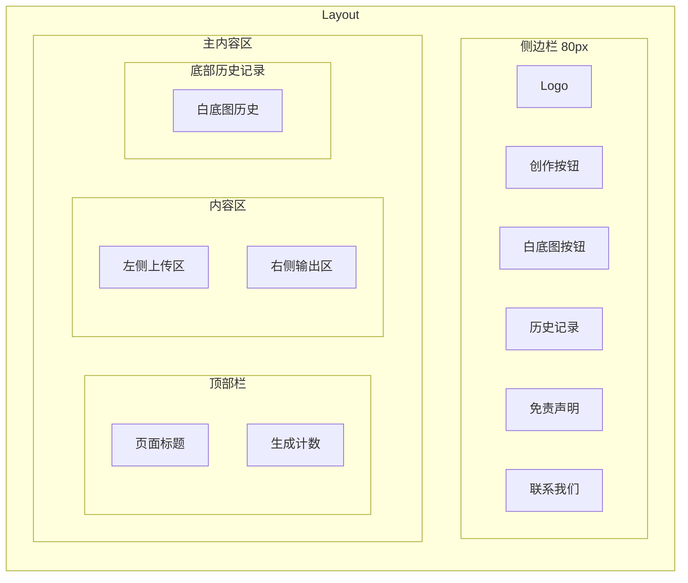

# Design Document: 一键白底图功能

## Overview

本设计文档描述 SIGMA AI 创意工坊的"一键白底图"功能模块。该功能为电商用户提供快速生成产品白底图的能力，支持光影去除选项，并集成生成计数、历史记录、免责声明和联系方式等辅助功能。

## Architecture

### 系统架构图



### 页面布局



## Components and Interfaces

### 前端组件

#### 1. WhiteBackground.tsx (新页面)
白底图生成主页面，采用左右分栏布局。

```typescript
interface WhiteBackgroundProps {}

// 页面状态
interface WhiteBackgroundState {
  uploadedFile: File | null;
  previewUrl: string | null;
  generatedImage: string | null;
  isGenerating: boolean;
  showShadowDialog: boolean;
  history: WhiteBackgroundHistory[];
}
```

#### 2. ShadowOptionDialog.tsx (新组件)
光影选项对话框，在用户点击生成时弹出。

```typescript
interface ShadowOptionDialogProps {
  isOpen: boolean;
  onClose: () => void;
  onConfirm: (removeShadow: boolean) => void;
}
```

#### 3. GenerationCounter.tsx (新组件)
生成计数器，显示在右上角。

```typescript
interface GenerationCounterProps {
  count: number;
}
```

#### 4. DisclaimerModal.tsx (新组件)
免责声明弹窗。

```typescript
interface DisclaimerModalProps {
  isOpen: boolean;
  onClose: () => void;
}
```

#### 5. ContactModal.tsx (新组件)
联系我们弹窗。

```typescript
interface ContactModalProps {
  isOpen: boolean;
  onClose: () => void;
  phone: string;
  wechatQrCode: string;
}
```

#### 6. Layout.tsx (修改)
更新侧边栏，添加白底图入口、免责声明和联系我们按钮。

### 后端接口

#### 1. 白底图生成接口 (复用现有)
复用现有的 `/generate` 接口，通过特定提示词实现白底图生成。

#### 2. 生成计数接口 (新增)

```go
// GET /stats/generation-count
// Response: { "count": number }

// POST /stats/increment-count
// Response: { "count": number }
```

#### 3. 白底图历史接口 (新增)

```go
// GET /history/white-background
// Response: GenerationHistory[] (filtered by type)
```

### API 接口扩展

```typescript
// frontend/src/api/index.ts 扩展
export const api = {
  // ... 现有接口
  
  // 获取生成计数
  async getGenerationCount(): Promise<Response>,
  
  // 增加生成计数
  async incrementGenerationCount(): Promise<Response>,
  
  // 获取白底图历史
  async getWhiteBackgroundHistory(): Promise<Response>,
}
```

## Data Models

### 数据库模型扩展

```go
// backend/models/generation_history.go 扩展
type GenerationHistory struct {
    gorm.Model
    Prompt         string `json:"prompt"`
    OriginalPrompt string `json:"original_prompt"`
    ImageURL       string `json:"image_url"`
    FileName       string `json:"file_name"`
    RefImages      string `json:"ref_images"`
    Type           string `json:"type"` // 新增: "create" | "white_background"
}

// 新增: 生成统计模型
type GenerationStats struct {
    gorm.Model
    TotalCount int `json:"total_count"`
}
```

### 前端类型定义

```typescript
// frontend/src/type/index.ts 扩展
export interface GenerationHistory {
  // ... 现有字段
  type?: 'create' | 'white_background';
}

export interface GenerationStats {
  total_count: number;
}
```

## Correctness Properties

*A property is a characteristic or behavior that should hold true across all valid executions of a system-essentially, a formal statement about what the system should do. Properties serve as the bridge between human-readable specifications and machine-verifiable correctness guarantees.*

### Property 1: 提示词构造正确性
*For any* 光影选项选择（保留或去除），构造的提示词应该包含基础提示词"不要修改图中的产品和位置，生成产品的白底图"，且当选择去除光影时，提示词应额外包含"去掉产品表面所有光影反射"
**Validates: Requirements 1.5, 6.1, 6.2**

### Property 2: 生成计数一致性
*For any* 成功的图片生成操作（创作空间或白底图），生成计数应该增加1，且计数值应该等于数据库中付费类型记录的总数
**Validates: Requirements 3.1**

### Property 3: 历史记录类型标记正确性
*For any* 白底图生成操作，保存到数据库的记录应该包含 type="white_background" 标记，且通过白底图历史接口查询时应该只返回该类型的记录
**Validates: Requirements 2.2**

## Error Handling

### 前端错误处理

| 错误场景 | 处理方式 |
|---------|---------|
| 未上传图片就点击生成 | Toast 提示"请先上传产品图片" |
| 图片上传失败 | Toast 提示"图片上传失败，请重试" |
| 生成接口调用失败 | Toast 提示具体错误信息 |
| 历史记录加载失败 | 显示空状态，控制台记录错误 |
| 计数接口调用失败 | 静默失败，不影响主流程 |

### 后端错误处理

| 错误场景 | HTTP 状态码 | 响应 |
|---------|------------|------|
| API Key 未配置 | 401 | `{"error": "请先配置 API Key"}` |
| 图片处理失败 | 500 | `{"error": "图片处理失败"}` |
| 数据库操作失败 | 500 | `{"error": "数据库错误"}` |

## Testing Strategy

### 单元测试

使用 Vitest 进行前端单元测试：

1. **提示词构造函数测试**
   - 测试保留光影时的提示词输出
   - 测试去除光影时的提示词输出

2. **组件渲染测试**
   - ShadowOptionDialog 渲染和交互
   - DisclaimerModal 内容验证
   - ContactModal 内容验证

### 属性测试

使用 fast-check 进行属性测试：

1. **Property 1 测试**: 验证提示词构造逻辑
   - 生成随机的光影选项布尔值
   - 验证输出提示词符合预期格式

2. **Property 2 测试**: 验证计数一致性
   - 模拟多次生成操作
   - 验证计数增量正确

3. **Property 3 测试**: 验证历史记录类型
   - 生成白底图记录
   - 验证类型标记正确

### 集成测试

1. 白底图生成完整流程测试
2. 历史记录筛选测试
3. 计数器更新测试

### 测试框架配置

- 前端: Vitest + @testing-library/react + fast-check
- 后端: Go testing package
