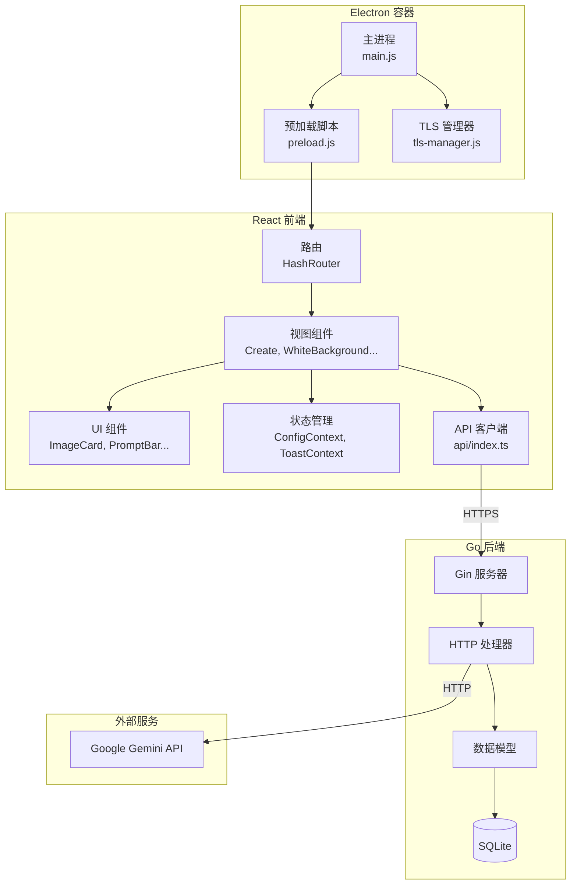
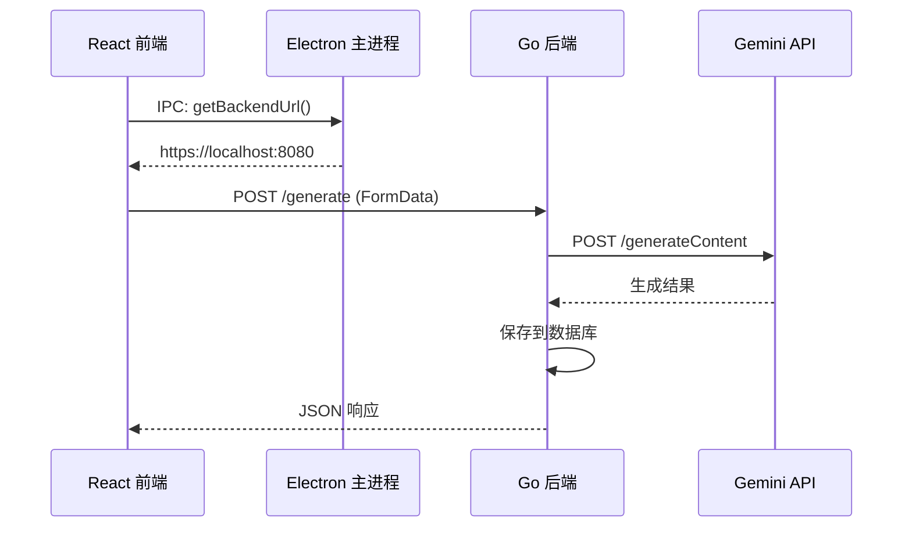
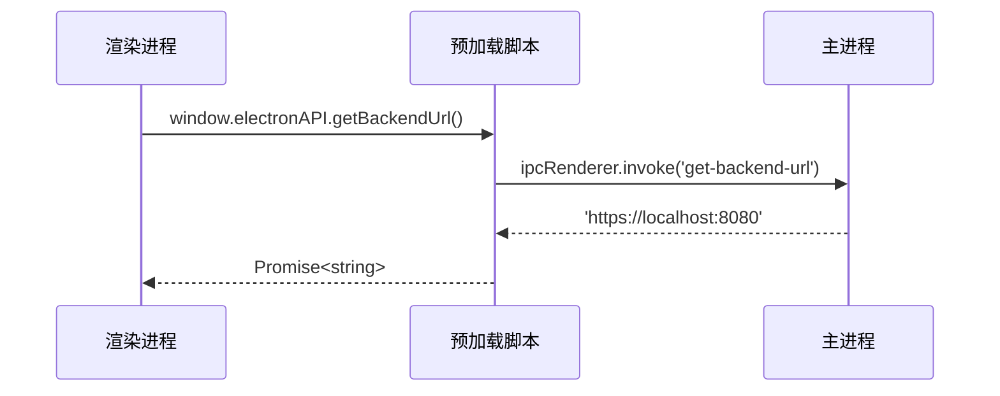
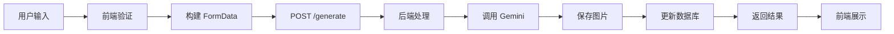
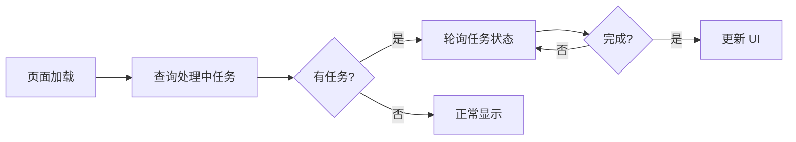
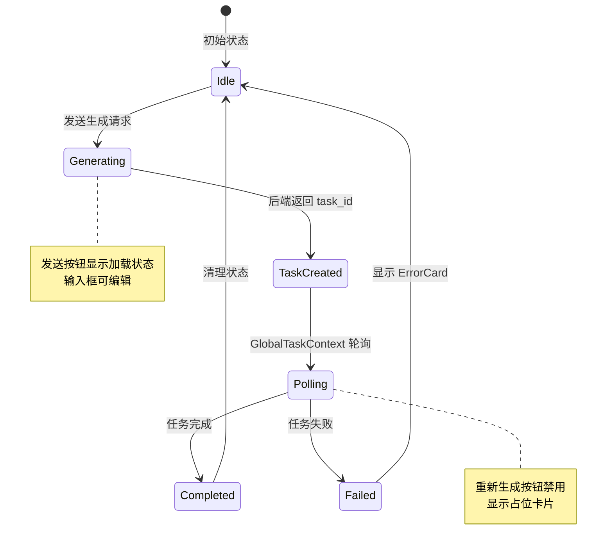

# 系统架构

Focus 采用三层架构设计，将桌面容器、用户界面和业务逻辑分离，实现关注点分离和模块化开发。

## 架构概览



## 层级说明

### 1. Electron 容器层

负责桌面应用的生命周期管理、窗口管理和进程间通信。

| 文件 | 职责 |
|------|------|
| `main.js` | 主进程入口，管理窗口、后端进程、IPC 通信 |
| `preload.js` | 预加载脚本，暴露安全的 API 给渲染进程 |
| `tls-manager.js` | TLS 证书生成和管理 |

**主要功能：**
- 创建和管理 BrowserWindow
- 启动和监控后端进程
- 生成自签名 TLS 证书
- 提供 IPC 通信桥接

### 2. React 前端层

负责用户界面渲染和交互逻辑。

| 目录 | 职责 |
|------|------|
| `views/` | 页面级组件（Create, WhiteBackground, History 等） |
| `components/` | 可复用 UI 组件 |
| `components/common/` | 通用组件（按钮、模态框、上传区等） |
| `context/` | React Context 状态管理 |
| `hooks/` | 自定义 Hooks |
| `api/` | API 客户端封装 |
| `router/` | 路由配置 |

**主要功能：**
- 图片上传和预览
- 提示词输入和生成控制
- 历史记录展示
- 任务状态恢复

### 3. Go 后端层

负责业务逻辑处理、数据持久化和外部 API 调用。

| 目录 | 职责 |
|------|------|
| `handlers/` | HTTP 请求处理器 |
| `models/` | 数据库模型定义 |
| `config/` | 配置管理 |
| `server/` | TLS 服务器配置 |
| `utils/` | 工具函数 |

**主要功能：**
- 接收生成请求并调用 Gemini API
- 管理生成历史和任务状态
- 提供静态文件服务
- 配置和统计管理

## 通信流程

### 前后端通信



### IPC 通信



## 数据流

### 图片生成流程



### 任务恢复流程



### 任务状态管理



## 安全设计

### TLS 加密

- 后端使用 HTTPS 协议
- 自签名证书在首次启动时生成
- 证书存储在用户数据目录

### API Key 保护

- API Key 仅存储在后端
- 前端通过后端代理调用外部 API
- 配置文件不纳入版本控制

### 进程隔离

- Electron 启用 contextIsolation
- 预加载脚本限制暴露的 API
- 渲染进程无法直接访问 Node.js API

## 目录结构映射

```
项目根目录
├── electron/           → Electron 容器层
├── frontend/src/       → React 前端层
│   ├── api/           → API 客户端
│   ├── components/    → UI 组件
│   ├── context/       → 状态管理
│   ├── hooks/         → 自定义 Hooks
│   ├── layout/        → 布局组件
│   ├── router/        → 路由配置
│   ├── type/          → 类型定义
│   ├── utils/         → 工具函数
│   └── views/         → 页面视图
└── backend/            → Go 后端层
    ├── handlers/      → HTTP 处理器
    ├── models/        → 数据模型
    ├── config/        → 配置管理
    ├── server/        → TLS 服务器
    ├── types/         → AI 类型定义
    └── utils/         → 工具函数
```

## 扩展点

### 添加新的生成类型

1. 在 `frontend/src/type/index.ts` 添加类型常量
2. 在 `backend/models/generation_history.go` 添加类型常量
3. 创建新的视图组件 `frontend/src/views/NewType.tsx`
4. 在路由配置中添加路由
5. 在侧边栏添加导航入口

### 添加新的 API 端点

1. 在 `backend/handlers/` 创建处理器
2. 在 `backend/main.go` 注册路由
3. 在 `frontend/src/api/index.ts` 添加客户端方法
4. 更新 API 文档
