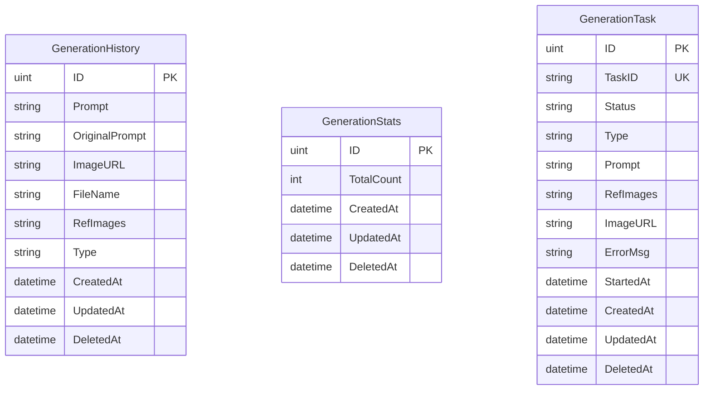
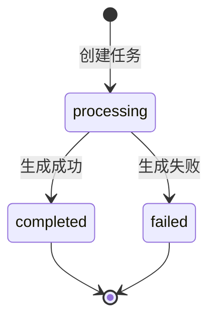

# 数据模型文档

Focus 后端使用 GORM 作为 ORM 框架，SQLite 作为数据库。

## 模型概览



## GenerationHistory

存储图片生成历史记录。

### 字段定义

| 字段 | 类型 | 约束 | 说明 |
|------|------|------|------|
| `ID` | uint | PK, AUTO | 主键 |
| `Prompt` | string | - | 处理后的提示词 |
| `OriginalPrompt` | string | - | 用户原始输入 |
| `ImageURL` | string | - | 生成图片的 URL |
| `FileName` | string | - | 图片文件名 |
| `RefImages` | string | - | 参考图片 URL 数组（JSON 字符串） |
| `Type` | string | DEFAULT 'create' | 生成类型 |
| `CreatedAt` | datetime | AUTO | 创建时间 |
| `UpdatedAt` | datetime | AUTO | 更新时间 |
| `DeletedAt` | datetime | - | 软删除时间 |

### 生成类型常量

```go
const (
    GenerationTypeCreate          = "create"           // 创作空间
    GenerationTypeWhiteBackground = "white_background" // 白底图
    GenerationTypeClothingChange  = "clothing_change"  // 换装
    GenerationTypeProductScene    = "product_scene"    // 商品图
    GenerationTypeLightShadow     = "light_shadow"     // 光影融合
)
```

### Go 结构体

```go
type GenerationHistory struct {
    gorm.Model
    Prompt         string `json:"prompt"`
    OriginalPrompt string `json:"original_prompt"`
    ImageURL       string `json:"image_url"`
    FileName       string `json:"file_name"`
    RefImages      string `json:"ref_images"`
    Type           string `json:"type" gorm:"default:create"`
}
```

### 响应结构体

```go
type GenerationHistoryResponse struct {
    ID             uint      `json:"id"`
    Prompt         string    `json:"prompt"`
    OriginalPrompt string    `json:"original_prompt"`
    ImageURL       string    `json:"image_url"`
    FileName       string    `json:"file_name"`
    RefImages      string    `json:"ref_images"`
    Type           string    `json:"type"`
    CreatedAt      time.Time `json:"created_at"`
    UpdatedAt      time.Time `json:"updated_at"`
}
```

---

## GenerationStats

存储生成统计信息（单例记录）。

### 字段定义

| 字段 | 类型 | 约束 | 说明 |
|------|------|------|------|
| `ID` | uint | PK, AUTO | 主键 |
| `TotalCount` | int | DEFAULT 0 | 总生成次数 |
| `CreatedAt` | datetime | AUTO | 创建时间 |
| `UpdatedAt` | datetime | AUTO | 更新时间 |
| `DeletedAt` | datetime | - | 软删除时间 |

### Go 结构体

```go
type GenerationStats struct {
    gorm.Model
    TotalCount int `json:"total_count" gorm:"default:0"`
}
```

### 响应结构体

```go
type GenerationStatsResponse struct {
    TotalCount int `json:"total_count"`
}
```

---

## GenerationTask

存储生成任务状态，用于任务恢复和状态追踪。

### 字段定义

| 字段 | 类型 | 约束 | 说明 |
|------|------|------|------|
| `ID` | uint | PK, AUTO | 主键 |
| `TaskID` | string | UK, NOT NULL | 任务唯一标识（UUID） |
| `Status` | string | NOT NULL, DEFAULT 'processing' | 任务状态 |
| `Type` | string | NOT NULL | 生成类型 |
| `Prompt` | string | - | 提示词 |
| `RefImages` | string | - | 参考图片 URL 数组（JSON） |
| `ImageURL` | string | - | 生成结果图片 URL |
| `ErrorMsg` | string | - | 错误信息 |
| `StartedAt` | datetime | NOT NULL | 任务开始时间 |
| `CreatedAt` | datetime | AUTO | 创建时间 |
| `UpdatedAt` | datetime | AUTO | 更新时间 |
| `DeletedAt` | datetime | - | 软删除时间 |

### 任务状态

```go
type TaskStatus string

const (
    TaskStatusProcessing TaskStatus = "processing" // 处理中
    TaskStatusCompleted  TaskStatus = "completed"  // 已完成
    TaskStatusFailed     TaskStatus = "failed"     // 失败
)
```

### 状态转换规则



- 只允许从 `processing` 转换到 `completed` 或 `failed`
- 完成状态不可逆转

### Go 结构体

```go
type GenerationTask struct {
    gorm.Model
    TaskID    string     `json:"task_id" gorm:"uniqueIndex;not null"`
    Status    TaskStatus `json:"status" gorm:"default:processing;not null"`
    Type      string     `json:"type" gorm:"not null"`
    Prompt    string     `json:"prompt"`
    RefImages string     `json:"ref_images"`
    ImageURL  string     `json:"image_url"`
    ErrorMsg  string     `json:"error_msg"`
    StartedAt time.Time  `json:"started_at" gorm:"not null"`
}
```

### 响应结构体

```go
type TaskResponse struct {
    ID        uint       `json:"id"`
    TaskID    string     `json:"task_id"`
    Status    TaskStatus `json:"status"`
    Type      string     `json:"type"`
    Prompt    string     `json:"prompt"`
    RefImages string     `json:"ref_images"`
    ImageURL  string     `json:"image_url"`
    ErrorMsg  string     `json:"error_msg"`
    StartedAt time.Time  `json:"started_at"`
    CreatedAt time.Time  `json:"created_at"`
    UpdatedAt time.Time  `json:"updated_at"`
}
```

### 方法

```go
// 转换为响应结构体
func (t *GenerationTask) ToResponse() TaskResponse

// 检查状态是否有效
func IsValidStatus(status TaskStatus) bool

// 检查状态转换是否有效
func (t *GenerationTask) CanTransitionTo(newStatus TaskStatus) bool

// 将任务标记为完成
func (t *GenerationTask) CompleteTask(imageURL string) bool

// 将任务标记为失败
func (t *GenerationTask) FailTask(errorMsg string) bool
```

---

## 数据库初始化

在 `main.go` 中自动迁移：

```go
config.DB.AutoMigrate(
    &models.GenerationHistory{},
    &models.GenerationStats{},
    &models.GenerationTask{},
)
```

## 数据库位置

- **开发环境**: `backend/history.db`
- **生产环境**: `%APPDATA%/Focus/db/history.db` (Windows)
