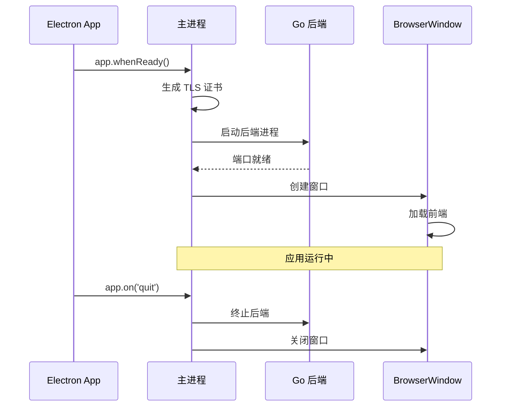

# Electron 开发指南

Focus 使用 Electron 33.x 作为桌面应用框架，管理窗口、后端进程和 IPC 通信。

## 目录结构

```
electron/
├── main.js              # 主进程入口
├── preload.js           # 预加载脚本
├── tls-manager.js       # TLS 证书管理
├── main.test.js         # 主进程测试
├── tls-manager.test.js  # TLS 管理器测试
├── e2e.test.js          # 端到端测试
└── build-validation.test.js  # 构建验证测试
```

## 主进程 (main.js)

### 职责

1. **窗口管理**：创建和管理 BrowserWindow
2. **后端进程管理**：启动、监控和终止 Go 后端
3. **TLS 证书管理**：生成和管理自签名证书
4. **IPC 通信**：处理渲染进程的请求
5. **环境配置**：设置后端运行环境

### 生命周期



### 关键代码

```javascript
// 创建窗口
function createWindow() {
  const win = new BrowserWindow({
    width: 1200,
    height: 800,
    webPreferences: {
      preload: path.join(__dirname, 'preload.js'),
      contextIsolation: true,
      nodeIntegration: false,
    },
  });

  // 开发模式加载 Vite 服务器
  if (isDev) {
    win.loadURL('http://localhost:5173');
    win.webContents.openDevTools();
  } else {
    // 生产模式加载打包的前端
    win.loadFile(path.join(__dirname, '../frontend/dist/index.html'));
  }
}
```

## 预加载脚本 (preload.js)

### 职责

在渲染进程和主进程之间建立安全的通信桥梁。

### 暴露的 API

```javascript
const { contextBridge, ipcRenderer } = require('electron');

contextBridge.exposeInMainWorld('electronAPI', {
  getBackendUrl: () => ipcRenderer.invoke('get-backend-url'),
});
```

### 安全性

- 启用 `contextIsolation`：隔离预加载脚本和渲染进程
- 禁用 `nodeIntegration`：渲染进程无法直接访问 Node.js
- 使用 `contextBridge`：安全地暴露有限的 API

## TLS 管理器 (tls-manager.js)

### 职责

生成和管理自签名 TLS 证书，用于后端 HTTPS 通信。

### 功能

```javascript
const { generateCertificate, ensureCertificates } = require('./tls-manager');

// 确保证书存在（不存在则生成）
await ensureCertificates(certDir);

// 强制重新生成证书
await generateCertificate(certDir);
```

### 证书配置

- **有效期**：365 天
- **密钥长度**：2048 位
- **算法**：RSA + SHA256
- **主题**：localhost

## IPC 通信

### 主进程处理器

```javascript
const { ipcMain } = require('electron');

// 获取后端 URL
ipcMain.handle('get-backend-url', () => {
  return `https://localhost:${backendPort}`;
});
```

### 渲染进程调用

```typescript
// 通过预加载脚本暴露的 API 调用
const url = await window.electronAPI.getBackendUrl();
```

## 后端进程管理

### 启动后端

```javascript
const { spawn } = require('child_process');

function startBackend() {
  const backendPath = getBackendPath();
  const env = {
    ...process.env,
    PORT: '8080',
    OUTPUT_DIR: path.join(userDataPath, 'output'),
    UPLOAD_DIR: path.join(userDataPath, 'uploads'),
    DB_PATH: path.join(userDataPath, 'db', 'history.db'),
    TLS_CERT_PATH: path.join(userDataPath, 'certs', 'cert.pem'),
    TLS_KEY_PATH: path.join(userDataPath, 'certs', 'key.pem'),
    PRODUCTION: 'true',
  };

  backendProcess = spawn(backendPath, [], { env });
  
  backendProcess.stdout.on('data', (data) => {
    console.log(`[Backend] ${data}`);
  });
  
  backendProcess.stderr.on('data', (data) => {
    console.error(`[Backend Error] ${data}`);
  });
}
```

### 终止后端

```javascript
function stopBackend() {
  if (backendProcess) {
    backendProcess.kill();
    backendProcess = null;
  }
}

app.on('quit', stopBackend);
```

### 后端路径

```javascript
function getBackendPath() {
  if (isDev) {
    // 开发模式：从 dist/backend 运行
    return path.join(__dirname, '../dist/backend/sigma-backend.exe');
  } else {
    // 生产模式：从 resources/backend 运行
    return path.join(process.resourcesPath, 'backend/sigma-backend.exe');
  }
}
```

## 开发模式

### 检测开发模式

```javascript
const isDev = !app.isPackaged;
```

### 开发模式特性

- 加载 Vite 开发服务器
- 自动打开 DevTools
- 后端从 `dist/backend` 运行
- 详细日志输出

### 启动开发模式

```bash
npm run dev
```

## 测试

### 单元测试

```bash
npm run test:electron
```

### 端到端测试

```bash
npm run test:e2e
```

### 构建验证测试

```bash
npm run test:build
```

## 调试

### 主进程调试

1. 在 VS Code 中配置 launch.json
2. 设置断点
3. 按 F5 启动调试

### 渲染进程调试

1. 开发模式下自动打开 DevTools
2. 或按 `Ctrl+Shift+I` 手动打开

### 后端日志

- 开发模式：输出到控制台
- 生产模式：输出到 `logs/app.log`

## 常见问题

### 后端启动失败

1. 检查后端可执行文件是否存在
2. 检查端口是否被占用
3. 查看后端日志

### 证书错误

1. 删除 `certs/` 目录
2. 重启应用，自动重新生成

### 窗口空白

1. 检查前端是否构建成功
2. 检查 Vite 开发服务器是否运行
3. 查看 DevTools 控制台错误
