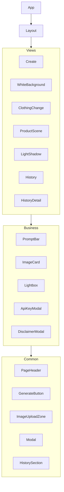

# 组件文档

Focus 前端组件分为通用组件、业务组件和视图组件三类。

## 组件层级



---

## 通用组件 (common/)

### PageHeader

页面顶部标题栏组件。

```typescript
interface PageHeaderProps {
  title: string;              // 页面标题
  statusColor?: 'green' | 'yellow' | 'red';  // 状态指示灯颜色
  showCounter?: boolean;      // 是否显示生成计数器
  counterRefresh?: number;    // 计数器刷新触发器
}
```

**用法：**

```tsx
<PageHeader
  title="AI 创意工坊"
  statusColor="green"
  showCounter
  counterRefresh={refreshCount}
/>
```

---

### GenerateButton

生成按钮组件，支持加载状态。

```typescript
interface GenerateButtonProps {
  onClick: () => void;        // 点击回调
  isGenerating: boolean;      // 是否正在生成
  disabled?: boolean;         // 是否禁用
  text?: string;              // 按钮文本
  loadingText?: string;       // 加载中文本
  icon?: React.ReactNode;     // 图标
  color?: 'red' | 'blue' | 'green';  // 颜色主题
  fullWidth?: boolean;        // 是否全宽
  className?: string;         // 额外样式类
}
```

**用法：**

```tsx
<GenerateButton
  onClick={handleGenerate}
  isGenerating={isLoading}
  disabled={!hasFile}
  text="生成白底图"
  loadingText="生成中..."
  icon={<ArrowRight />}
  color="red"
  fullWidth
/>
```

---

### ImageUploadZone

图片上传区域组件，支持拖拽和点击上传。

```typescript
interface ImageUploadZoneProps {
  file: File | null;          // 当前文件
  previewUrl: string | null;  // 预览 URL
  onFileSelect: (file: File) => void;  // 文件选择回调
  onClear: () => void;        // 清除回调
  onPreview?: (url: string) => void;   // 预览回调
  onContextMenu?: (e: React.MouseEvent, url: string) => void;
  emptyTitle?: string;        // 空状态标题
  emptySubtitle?: string;     // 空状态副标题
  accentColor?: 'red' | 'blue' | 'green';  // 强调色
  accept?: string;            // 接受的文件类型
}
```

**用法：**

```tsx
<ImageUploadZone
  file={uploadedFile}
  previewUrl={previewUrl}
  onFileSelect={handleFileSelect}
  onClear={handleClear}
  onPreview={setLightboxImage}
  emptyTitle="点击或拖拽上传图片"
  emptySubtitle="支持 JPG、PNG 格式"
  accentColor="red"
/>
```

---

### Modal

通用模态框组件。

```typescript
interface ModalProps {
  isOpen: boolean;            // 是否打开
  onClose: () => void;        // 关闭回调
  title?: string;             // 标题
  children: React.ReactNode;  // 内容
  size?: 'sm' | 'md' | 'lg';  // 尺寸
}
```

**用法：**

```tsx
<Modal isOpen={showModal} onClose={() => setShowModal(false)} title="设置">
  <p>模态框内容</p>
</Modal>
```

---

### HistorySection

历史记录展示区域组件。

```typescript
interface HistorySectionProps {
  title: string;              // 标题
  history: GenerationHistory[];  // 历史数据
  onImageClick: (item: GenerationHistory) => void;  // 图片点击
  onImagePreview: (url: string) => void;  // 图片预览
  emptyText?: string;         // 空状态文本
}
```

**用法：**

```tsx
<HistorySection
  title="白底图历史记录"
  history={historyList}
  onImageClick={handleHistoryClick}
  onImagePreview={setLightboxImage}
  emptyText="暂无生成记录"
/>
```

---

### QuotaErrorHandler

配额错误处理组件，包含错误弹窗和联系销售弹窗。

```typescript
interface QuotaErrorHandlerProps {
  showQuotaError: boolean;    // 是否显示配额错误
  showContact: boolean;       // 是否显示联系弹窗
  onQuotaErrorClose: () => void;
  onContactClose: () => void;
  onContactSales: () => void;
}
```

---

## 业务组件

### PromptBar

提示词输入栏组件，包含文本输入、参考图上传、宽高比选择、生成数量选择和生成按钮。

```typescript
interface PromptBarProps {
  onGenerate: (response: GenerateResponse) => void;  // 单图生成完成回调
  onGenerateMulti?: (response: GenerateMultiResponse) => void;  // 多图生成回调
  onGenerateStart?: (prompt?: string, imageCount?: number) => void;  // 生成开始回调
  onError: (error: string, prompt?: string, imageCount?: number) => void;  // 错误回调
  onPreviewImage?: (url: string) => void;   // 预览回调
  initialPrompt?: string;     // 初始提示词
  initialFiles?: File[];      // 初始参考图
  onFilesChange?: (files: File[]) => void;  // 文件变化回调
  triggerGenerate?: boolean;  // 触发生成
  onTriggered?: () => void;   // 触发后回调
  // SSE 流式回调
  onSSEStart?: (event: SSEStartEvent) => void;
  onSSEImage?: (event: SSEImageEvent) => void;
  onSSEComplete?: (event: SSECompleteEvent) => void;
  // 禁用状态
  disabled?: boolean;         // 外部禁用控制
  isTaskRunning?: boolean;    // 任务运行状态（禁用发送按钮）
  onTaskCreated?: (taskId: string) => void;  // 异步任务创建回调
  promptVersion?: number;     // 提示词更新版本号
}
```

**功能特性：**
- 发送后自动清空输入框，允许用户编辑下一个任务
- 任务运行时发送按钮显示加载状态
- 支持拖拽、粘贴图片
- 支持宽高比选择（1:1, 16:9, 9:16 等）
- 支持批量生成（1-4张）

**用法：**

```tsx
<PromptBar
  onGenerate={handleGenerate}
  onGenerateMulti={handleGenerateMulti}
  onGenerateStart={handleGenerateStart}
  onError={handleError}
  initialPrompt={selectedPrompt}
  initialFiles={selectedFiles}
  onFilesChange={setSelectedFiles}
  onPreviewImage={setLightboxImage}
  isTaskRunning={isTaskRunning}
  onTaskCreated={setCurrentTaskId}
/>
```

---

### ImageCard

图片卡片组件，展示生成结果和参考图。

```typescript
interface ImageCardProps {
  item: GenerationHistory;    // 历史记录项
  onImageClick: (url: string) => void;  // 图片点击
  onRefImageClick?: (url: string) => void;  // 参考图点击
  onRegenerate?: (item: GenerationHistory) => void;  // 重新生成
  onEditPrompt?: (item: GenerationHistory) => void;  // 编辑提示词
  onUseAsReference?: (url: string) => void;  // 作为参考图
  hidePrompt?: boolean;       // 是否隐藏提示词
  disabled?: boolean;         // 是否禁用重新生成按钮
}
```

**功能特性：**
- 支持图片拖拽到 PromptBar 作为参考图
- 右键菜单支持下载、复制、引用等操作
- 任务运行时重新生成按钮显示禁用状态

---

### Lightbox

图片灯箱组件，全屏预览图片。

```typescript
interface LightboxProps {
  imageUrl: string | null;    // 图片 URL
  onClose: () => void;        // 关闭回调
}
```

**用法：**

```tsx
<Lightbox imageUrl={lightboxImage} onClose={() => setLightboxImage(null)} />
```

---

### PlaceholderCard

占位卡片组件，显示加载动画。

```typescript
// 无 Props，纯展示组件
```

**用法：**

```tsx
{isGenerating && <PlaceholderCard />}
```

---

### ErrorCard

错误卡片组件，显示生成失败信息和重试按钮。

```typescript
interface ErrorCardProps {
  errorMessage: string;       // 错误信息
  prompt?: string;            // 提示词
  onRetry?: () => void;       // 重试回调
  disabled?: boolean;         // 是否禁用重试按钮
}
```

**功能特性：**
- 显示错误图标和错误信息
- 提供重试按钮
- 任务运行时重试按钮显示禁用状态

**用法：**

```tsx
<ErrorCard
  errorMessage="生成失败，请重试"
  prompt={failedPrompt}
  onRetry={handleRetry}
  disabled={isTaskRunning}
/>
```

---

### ImageContextMenu

图片右键菜单组件。

```typescript
interface ImageContextMenuProps {
  imageUrl: string;           // 图片 URL
  position: { x: number; y: number } | null;  // 菜单位置
  onClose: () => void;        // 关闭回调
  showReferenceOption?: boolean;  // 是否显示"作为参考图"选项
  onUseAsReference?: (url: string) => void;
}
```

---

### ApiKeyModal

API Key 设置弹窗。

```typescript
interface ApiKeyModalProps {
  isOpen: boolean;
  onClose: () => void;
  onSuccess?: () => void;     // 设置成功回调
}
```

---

### DisclaimerModal

免责声明弹窗。

```typescript
interface DisclaimerModalProps {
  isOpen: boolean;
  onClose: () => void;
  hasAgreed?: boolean;        // 是否已同意
  requireAgree?: boolean;     // 是否需要同意才能关闭
}
```

---

### ShadowOptionDialog

阴影选项对话框（白底图功能）。

```typescript
interface ShadowOptionDialogProps {
  isOpen: boolean;
  onClose: () => void;
  onConfirm: (removeShadow: boolean) => void;  // 确认回调
}
```

---

### GenerationCounter

生成计数器组件。

```typescript
interface GenerationCounterProps {
  refresh?: number;           // 刷新触发器
}
```

---

### AspectRatioSelector

宽高比选择器组件。

```typescript
interface AspectRatioSelectorProps {
  value: AspectRatio;         // 当前值
  onChange: (ratio: AspectRatio) => void;  // 变化回调
}
```

---

## 视图组件 (views/)

### Create

创作空间页面，支持文本生成和图生图。

**功能：**
- 提示词输入（支持中英文）
- 参考图上传（支持拖拽、粘贴）
- 宽高比选择（1:1, 16:9, 9:16 等）
- 批量生成（1-4张）
- 历史记录展示（按批次分组）
- 任务恢复（页面刷新后自动恢复）
- 失败重试（ErrorCard 显示）
- 任务状态管理（运行时禁用重新生成按钮）

**状态管理：**
- `isTaskRunning`: 统一的任务运行状态
- `currentTaskId`: 当前异步任务 ID
- `processingTasks`: 恢复的处理中任务列表
- `batchResults`: 批量生成结果
- `failedGenerations`: 失败的生成记录

---

### WhiteBackground

白底图生成页面。

**功能：**
- 产品图上传
- 阴影选项选择
- 生成结果展示
- 历史记录

---

### ClothingChange

换装页面。

**功能：**
- 人物图上传
- 服装图上传
- 生成结果展示

---

### ProductScene

商品图生成页面。

**功能：**
- 产品图上传
- 场景描述输入
- 生成结果展示

---

### LightShadow

光影融合页面。

**功能：**
- 产品图上传
- 参考光影图上传
- 生成结果展示

---

### History

历史记录列表页面。

**功能：**
- 按日期分组展示
- 点击进入详情

---

### HistoryDetail

历史记录详情页面。

**功能：**
- 展示指定日期的所有生成记录
- 图片预览和操作
