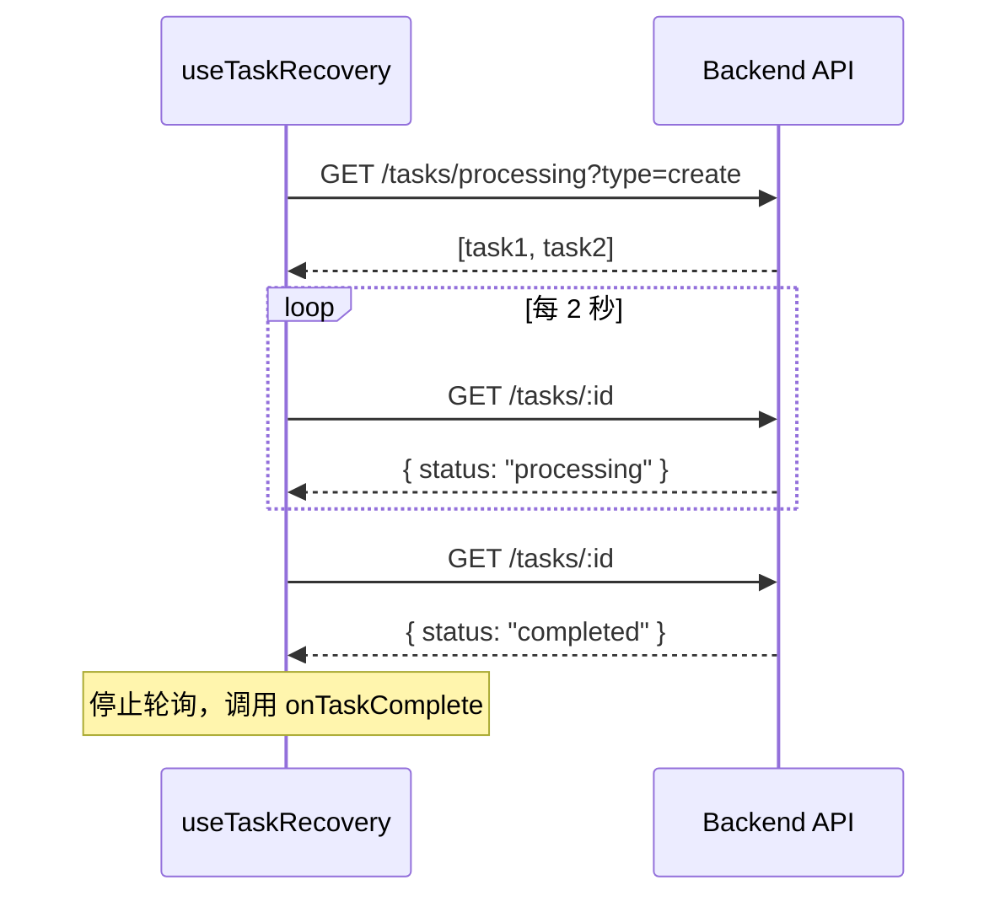

# 自定义 Hooks 文档

Focus 前端使用自定义 Hooks 封装可复用的状态逻辑。

## useImageUpload

管理图片上传状态和预览 URL 生命周期。

### 接口

```typescript
interface UseImageUploadOptions {
  onFileSelect?: (file: File) => void;  // 文件选择回调
}

interface UseImageUploadReturn {
  file: File | null;          // 当前文件
  previewUrl: string | null;  // 预览 URL
  setFile: (file: File | null) => void;  // 设置文件
  handleFileSelect: (e: React.ChangeEvent<HTMLInputElement>) => void;
  handleUrlLoad: (url: string) => Promise<void>;  // 从 URL 加载
  clear: () => void;          // 清除
}

function useImageUpload(options?: UseImageUploadOptions): UseImageUploadReturn
```

### 功能

- 自动管理 `URL.createObjectURL` 和 `URL.revokeObjectURL`
- 组件卸载时自动清理 URL
- 支持从 URL 加载图片

### 用法

```tsx
function ImageUploader() {
  const { file, previewUrl, setFile, handleFileSelect, clear } = useImageUpload({
    onFileSelect: (file) => console.log('Selected:', file.name)
  });

  return (
    <div>
      <input type="file" onChange={handleFileSelect} accept="image/*" />
      {previewUrl && }
      <button onClick={clear}>清除</button>
    </div>
  );
}
```

---

## useTaskRecovery

恢复和监控正在处理的生成任务，用于页面刷新后的任务恢复。

### 接口

```typescript
interface UseTaskRecoveryOptions {
  type: GenerationTypeValue;  // 任务类型
  onTaskComplete: (task: GenerationTask) => void;  // 完成回调
  onTaskFailed: (task: GenerationTask) => void;    // 失败回调
}

interface UseTaskRecoveryResult {
  processingTasks: GenerationTask[];  // 处理中的任务列表
  isRecovering: boolean;              // 是否正在恢复
}

function useTaskRecovery(options: UseTaskRecoveryOptions): UseTaskRecoveryResult
```

### 功能

- 页面加载时查询处理中的任务
- 每 2 秒轮询任务状态
- 任务完成或失败时停止轮询
- 组件卸载时清理所有轮询

### 用法

```tsx
function CreatePage() {
  const handleTaskComplete = useCallback((task: GenerationTask) => {
    console.log('Task completed:', task.image_url);
    loadHistory();
  }, []);

  const handleTaskFailed = useCallback((task: GenerationTask) => {
    console.error('Task failed:', task.error_msg);
  }, []);

  const { processingTasks, isRecovering } = useTaskRecovery({
    type: GenerationType.CREATE,
    onTaskComplete: handleTaskComplete,
    onTaskFailed: handleTaskFailed,
  });

  if (isRecovering) {
    return <div>正在恢复任务状态...</div>;
  }

  return (
    <div>
      {processingTasks.map(task => (
        <div key={task.task_id}>处理中: {task.prompt}</div>
      ))}
    </div>
  );
}
```

### 轮询机制



---

## useDragDrop

管理拖拽状态和事件处理。

### 接口

```typescript
interface UseDragDropOptions {
  onFileDrop: (file: File) => void;  // 文件拖放回调
  onUrlDrop?: (url: string) => Promise<void>;  // URL 拖放回调
  disabled?: boolean;  // 是否禁用
}

interface UseDragDropReturn {
  isDragging: boolean;  // 是否正在拖拽
  dragProps: {
    onDragOver: (e: React.DragEvent) => void;
    onDragLeave: (e: React.DragEvent) => void;
    onDrop: (e: React.DragEvent) => void;
  };
}

function useDragDrop(options: UseDragDropOptions): UseDragDropReturn
```

### 辅助函数

```typescript
// 检查文件是否为图片
function isImageFile(file: File): boolean

// 检查 URL 是否为图片 URL
function isImageUrl(url: string): boolean

// 从 FileList 提取图片文件
function extractImageFiles(files: FileList): File[]
```

### 功能

- 管理拖拽状态（isDragging）
- 支持文件拖放
- 支持 URL 拖放（应用内图片拖拽）
- 自动过滤非图片文件

### 用法

```tsx
function DropZone() {
  const { file, setFile } = useImageUpload();
  
  const { isDragging, dragProps } = useDragDrop({
    onFileDrop: setFile,
    onUrlDrop: async (url) => {
      const response = await fetch(url);
      const blob = await response.blob();
      const file = new File([blob], 'dropped.png', { type: blob.type });
      setFile(file);
    },
  });

  return (
    <div
      {...dragProps}
      className={`drop-zone ${isDragging ? 'dragging' : ''}`}
    >
      {isDragging ? '释放以上传' : '拖拽图片到这里'}
    </div>
  );
}
```

---

## useToast

获取 Toast 通知上下文。

### 接口

```typescript
interface ToastContextValue {
  success: (message: string) => void;
  error: (message: string) => void;
  warning: (message: string) => void;
  info: (message: string) => void;
}

function useToast(): ToastContextValue
```

### 用法

```tsx
function MyComponent() {
  const toast = useToast();

  const handleSave = async () => {
    try {
      await saveData();
      toast.success('保存成功');
    } catch (error) {
      toast.error('保存失败');
    }
  };

  return <button onClick={handleSave}>保存</button>;
}
```

---

## 最佳实践

### 1. 使用 useCallback 包装回调

```typescript
// ✅ 推荐
const handleComplete = useCallback((task: GenerationTask) => {
  loadHistory();
}, [loadHistory]);

const { processingTasks } = useTaskRecovery({
  type: GenerationType.CREATE,
  onTaskComplete: handleComplete,
  onTaskFailed: handleFailed,
});

// ❌ 避免
const { processingTasks } = useTaskRecovery({
  type: GenerationType.CREATE,
  onTaskComplete: (task) => loadHistory(), // 每次渲染创建新函数
  onTaskFailed: handleFailed,
});
```

### 2. 组合使用 Hooks

```typescript
function ImageUploadZone() {
  const { file, previewUrl, setFile, clear } = useImageUpload();
  
  const { isDragging, dragProps } = useDragDrop({
    onFileDrop: setFile,
    onUrlDrop: async (url) => {
      // 从 URL 加载图片
    },
  });

  return (
    <div {...dragProps}>
      {/* 上传区域 */}
    </div>
  );
}
```

### 3. 清理资源

Hooks 会自动在组件卸载时清理资源：
- `useImageUpload`: 释放 Object URL
- `useTaskRecovery`: 清除轮询定时器
- `useDragDrop`: 无需清理
