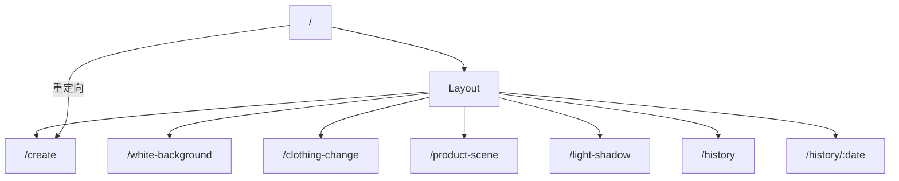

# 路由文档

Focus 前端使用 React Router v7 进行路由管理，采用 HashRouter 以支持 Electron 的 `file://` 协议。

## 路由配置

路由配置位于 `frontend/src/router/index.tsx`。

```typescript
import { createHashRouter } from 'react-router-dom';

export const router = createHashRouter([
  {
    path: '/',
    element: <Layout />,
    children: [
      { index: true, element: <Navigate to="/create" replace /> },
      { path: 'create', element: <Create /> },
      { path: 'white-background', element: <WhiteBackground /> },
      { path: 'clothing-change', element: <ClothingChange /> },
      { path: 'product-scene', element: <ProductScene /> },
      { path: 'light-shadow', element: <LightShadow /> },
      { path: 'history', element: <History /> },
      { path: 'history/:date', element: <HistoryDetail /> },
    ],
  },
]);
```

## 路由结构



## 路由表

| 路径 | 组件 | 说明 |
|------|------|------|
| `/` | - | 重定向到 `/create` |
| `/create` | `Create` | 创作空间 |
| `/white-background` | `WhiteBackground` | 白底图生成 |
| `/clothing-change` | `ClothingChange` | 换装 |
| `/product-scene` | `ProductScene` | 商品图生成 |
| `/light-shadow` | `LightShadow` | 光影融合 |
| `/history` | `History` | 历史记录列表 |
| `/history/:date` | `HistoryDetail` | 历史记录详情 |

## 布局结构

所有页面共享 `Layout` 组件作为父布局：

```
┌─────────────────────────────────────────┐
│                 Layout                   │
├──────┬──────────────────────────────────┤
│      │                                   │
│ Side │         <Outlet />                │
│ bar  │      (页面内容区)                  │
│      │                                   │
│      │                                   │
└──────┴──────────────────────────────────┘
```

## 导航

### 编程式导航

```typescript
import { useNavigate } from 'react-router-dom';

function MyComponent() {
  const navigate = useNavigate();
  
  const goToCreate = () => navigate('/create');
  const goToHistory = () => navigate('/history');
  const goToHistoryDetail = (date: string) => navigate(`/history/${date}`);
  const goBack = () => navigate(-1);
}
```

### 声明式导航

```tsx
import { Link } from 'react-router-dom';

<Link to="/create">创作空间</Link>
<Link to="/history/2025-01-01">查看详情</Link>
```

## 路由参数

### 获取路径参数

```typescript
import { useParams } from 'react-router-dom';

function HistoryDetail() {
  const { date } = useParams<{ date: string }>();
  // date: "2025-01-01"
}
```

### 获取查询参数

```typescript
import { useSearchParams } from 'react-router-dom';

function History() {
  const [searchParams, setSearchParams] = useSearchParams();
  const page = searchParams.get('page') || '1';
}
```

## 当前路由检测

```typescript
import { useLocation } from 'react-router-dom';

function Layout() {
  const location = useLocation();
  
  const isActive = (path: string) => {
    return location.pathname === path || 
           location.pathname.startsWith(path + '/');
  };
  
  // 检查是否在电商处理子菜单
  const ecommercePaths = [
    '/white-background', 
    '/clothing-change', 
    '/product-scene', 
    '/light-shadow'
  ];
  const isEcommerceActive = ecommercePaths.some(
    path => location.pathname === path
  );
}
```

## 侧边栏导航结构

```
├── 创作 (/create)
├── 电商 (子菜单)
│   ├── 白底图 (/white-background)
│   ├── 换装 (/clothing-change)
│   ├── 商品图 (/product-scene)
│   └── 光影 (/light-shadow)
└── 历史 (/history)
```

## HashRouter vs BrowserRouter

Focus 使用 `HashRouter` 而非 `BrowserRouter`：

| 特性 | HashRouter | BrowserRouter |
|------|------------|---------------|
| URL 格式 | `/#/create` | `/create` |
| 服务器配置 | 不需要 | 需要 |
| Electron 支持 | ✅ 完美支持 | ❌ file:// 不支持 |
| SEO | 不友好 | 友好 |

**选择原因：**
- Electron 使用 `file://` 协议加载前端
- `BrowserRouter` 需要服务器支持 history fallback
- `HashRouter` 在客户端完全处理路由

## 路由守卫

当前版本未实现路由守卫，如需添加：

```typescript
// 示例：需要 API Key 才能访问的路由
function RequireApiKey({ children }: { children: React.ReactNode }) {
  const { hasApiKey } = useConfig();
  const location = useLocation();
  
  if (!hasApiKey) {
    return <Navigate to="/settings" state={{ from: location }} replace />;
  }
  
  return children;
}

// 使用
{
  path: 'create',
  element: (
    <RequireApiKey>
      <Create />
    </RequireApiKey>
  ),
}
```

## 添加新路由

1. 创建视图组件 `frontend/src/views/NewPage.tsx`
2. 在 `router/index.tsx` 添加路由配置
3. 在 `Layout.tsx` 侧边栏添加导航入口
4. 更新文档
