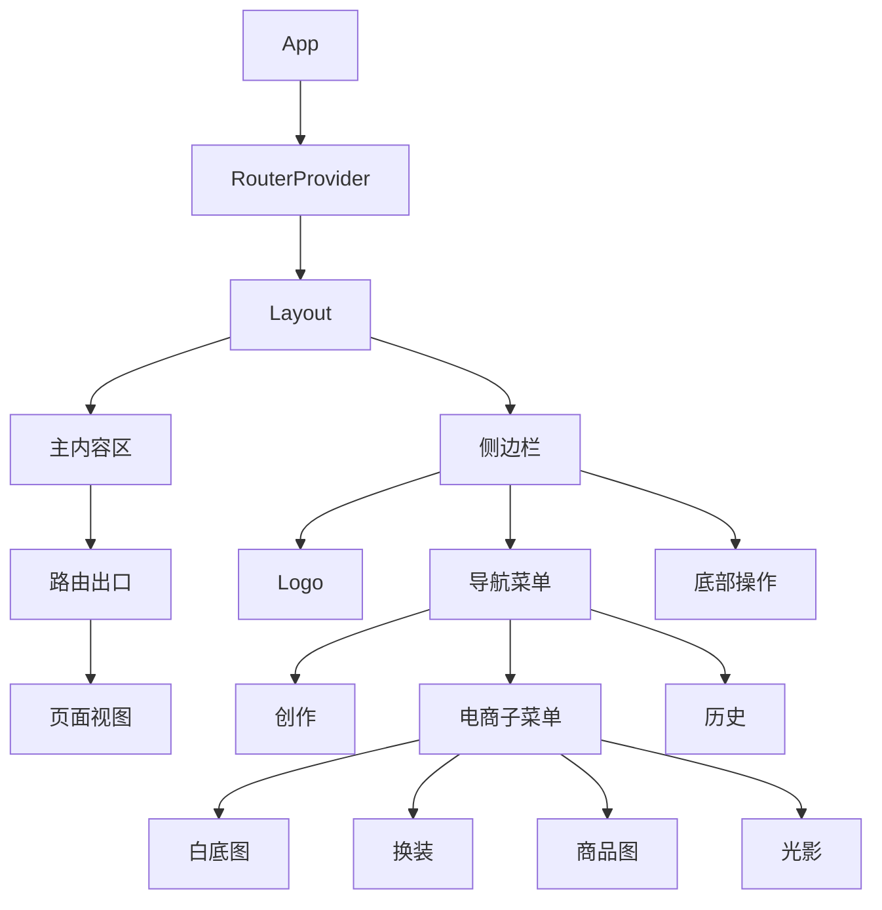

# 布局文档

Focus 采用侧边栏 + 内容区的经典布局结构。

## 整体布局

```
┌──────────────────────────────────────────────────────────────┐
│                        应用窗口                               │
├────────┬─────────────────────────────────────────────────────┤
│        │                                                      │
│        │                    PageHeader                        │
│        │  ┌──────────────────────────────────────────────┐   │
│ Sidebar│  │  标题              状态指示灯    生成计数器    │   │
│        │  └──────────────────────────────────────────────┘   │
│  80px  │                                                      │
│        │                    内容区域                          │
│        │  ┌──────────────────────────────────────────────┐   │
│        │  │                                               │   │
│        │  │              页面具体内容                      │   │
│        │  │              (Outlet)                         │   │
│        │  │                                               │   │
│        │  └──────────────────────────────────────────────┘   │
│        │                                                      │
└────────┴─────────────────────────────────────────────────────┘
```

## 布局组件层级



## 侧边栏 (Sidebar)

### 结构

```
┌────────┐
│  Logo  │  ← 品牌标识
├────────┤
│  创作  │  ← 主导航
├────────┤
│  电商  │  ← 带子菜单
│   ├→   │
├────────┤
│  历史  │
├────────┤
│        │
│        │  ← 弹性空间
│        │
├────────┤
│  设置  │  ← 底部操作
│  免责  │
│  联系  │
│  升级  │
└────────┘
```

### 尺寸

- 宽度：80px
- 高度：100vh
- 图标大小：24px (w-6 h-6)
- 文字大小：10px

### 电商子菜单

悬停展开的子菜单：

```
┌────────┐     ┌──────────┐
│  电商  │ ──→ │  白底图  │
│   ├→   │     │  换装    │
└────────┘     │  商品图  │
               │  光影    │
               └──────────┘
```

## 页面视图结构

### 创作空间 (Create)

```
┌─────────────────────────────────────────┐
│              PageHeader                  │
├─────────────────────────────────────────┤
│                                          │
│  ┌─────────────────────────────────┐    │
│  │     空状态 / 历史消息流          │    │
│  │                                  │    │
│  │  ┌─────────────────────────┐    │    │
│  │  │ 用户输入气泡            │    │    │
│  │  └─────────────────────────┘    │    │
│  │                                  │    │
│  │  ┌─────────────────────────┐    │    │
│  │  │ AI 头像 + ImageCard     │    │    │
│  │  └─────────────────────────┘    │    │
│  │                                  │    │
│  └─────────────────────────────────┘    │
│                                          │
├─────────────────────────────────────────┤
│              PromptBar                   │
│  ┌─────────────────────────────────┐    │
│  │ 参考图 | 输入框 | 宽高比 | 发送 │    │
│  └─────────────────────────────────┘    │
└─────────────────────────────────────────┘
```

### 电商功能页面 (WhiteBackground 等)

```
┌─────────────────────────────────────────┐
│              PageHeader                  │
├─────────────────────────────────────────┤
│                                          │
│  ┌─────────────┐  ┌─────────────┐       │
│  │  上传区域   │  │  生成结果   │       │
│  │             │  │             │       │
│  │  [图片预览] │  │  [结果预览] │       │
│  │             │  │             │       │
│  │  [生成按钮] │  │             │       │
│  └─────────────┘  └─────────────┘       │
│                                          │
│  ┌─────────────────────────────────┐    │
│  │         历史记录区域             │    │
│  │  [图片] [图片] [图片] [图片]    │    │
│  └─────────────────────────────────┘    │
│                                          │
└─────────────────────────────────────────┘
```

### 历史记录页面 (History)

```
┌─────────────────────────────────────────┐
│              PageHeader                  │
├─────────────────────────────────────────┤
│                                          │
│  ┌─────────────────────────────────┐    │
│  │  日期分组                        │    │
│  │  ┌─────────────────────────┐    │    │
│  │  │ 2025-01-01              │    │    │
│  │  │ [缩略图] [缩略图] ...   │    │    │
│  │  └─────────────────────────┘    │    │
│  │                                  │    │
│  │  ┌─────────────────────────┐    │    │
│  │  │ 2024-12-31              │    │    │
│  │  │ [缩略图] [缩略图] ...   │    │    │
│  │  └─────────────────────────┘    │    │
│  └─────────────────────────────────┘    │
│                                          │
└─────────────────────────────────────────┘
```

## 响应式设计

### 断点

| 断点 | 宽度 | 说明 |
|------|------|------|
| `sm` | 640px | 小屏幕 |
| `md` | 768px | 中等屏幕 |
| `lg` | 1024px | 大屏幕 |
| `xl` | 1280px | 超大屏幕 |

### 布局适配

```css
/* 电商页面双栏布局 */
.grid-cols-1 lg:grid-cols-2

/* 历史记录网格 */
.grid-cols-2 sm:grid-cols-3 md:grid-cols-4 lg:grid-cols-5
```

## 模态框层级

```
┌─────────────────────────────────────────┐
│                 应用                     │
│  ┌───────────────────────────────────┐  │
│  │            Lightbox (z-50)        │  │
│  │  ┌─────────────────────────────┐  │  │
│  │  │      Modal (z-50)           │  │  │
│  │  │  ┌───────────────────────┐  │  │  │
│  │  │  │   ContextMenu (z-50)  │  │  │  │
│  │  │  └───────────────────────┘  │  │  │
│  │  └─────────────────────────────┘  │  │
│  └───────────────────────────────────┘  │
└─────────────────────────────────────────┘
```

### z-index 层级

| 层级 | z-index | 用途 |
|------|---------|------|
| 侧边栏 | z-50 | 固定侧边栏 |
| 模态框背景 | z-40 | 遮罩层 |
| 模态框内容 | z-50 | 弹窗内容 |
| 灯箱 | z-50 | 图片预览 |
| 右键菜单 | z-50 | 上下文菜单 |
| Toast | z-50 | 通知提示 |

## 组件组合示例

### 电商页面模板

```tsx
function EcommercePage() {
  return (
    <>
      <PageHeader title="页面标题" showCounter />
      
      <div className="flex-1 overflow-y-auto p-6">
        <div className="max-w-6xl mx-auto">
          {/* 上传和结果区 */}
          <div className="grid grid-cols-1 lg:grid-cols-2 gap-6 mb-8">
            <div className="bg-white rounded-2xl p-6">
              <ImageUploadZone ... />
              <GenerateButton ... />
            </div>
            <div className="bg-white rounded-2xl p-6">
              {/* 结果展示 */}
            </div>
          </div>
          
          {/* 历史记录 */}
          <HistorySection ... />
        </div>
      </div>
      
      {/* 模态框 */}
      <Lightbox ... />
      <QuotaErrorHandler ... />
    </>
  );
}
```

## 动画效果

### 淡入上移

```css
.fade-in-up {
  animation: fadeInUp 0.3s ease-out;
}

@keyframes fadeInUp {
  from {
    opacity: 0;
    transform: translateY(10px);
  }
  to {
    opacity: 1;
    transform: translateY(0);
  }
}
```

### 脉冲动画

```css
.animate-pulse {
  animation: pulse 2s cubic-bezier(0.4, 0, 0.6, 1) infinite;
}
```

### 旋转动画

```css
.animate-spin {
  animation: spin 1s linear infinite;
}
```
